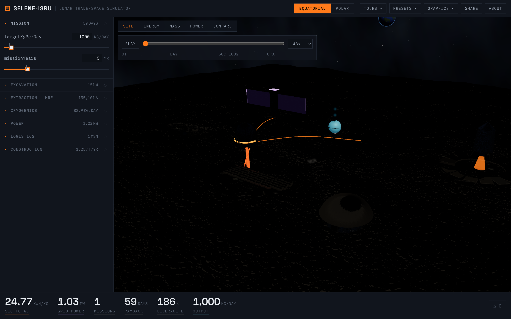
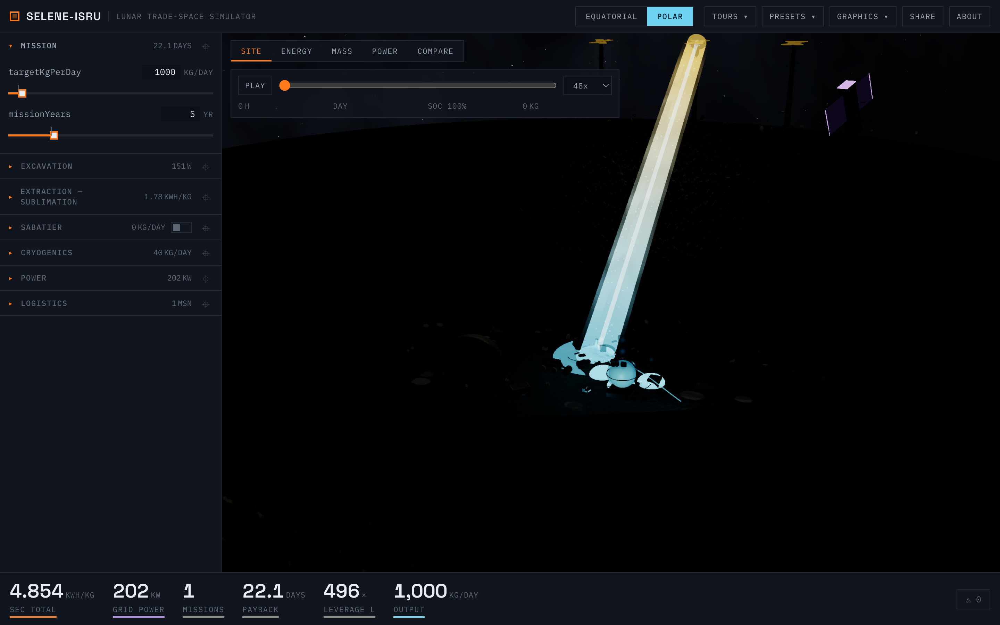
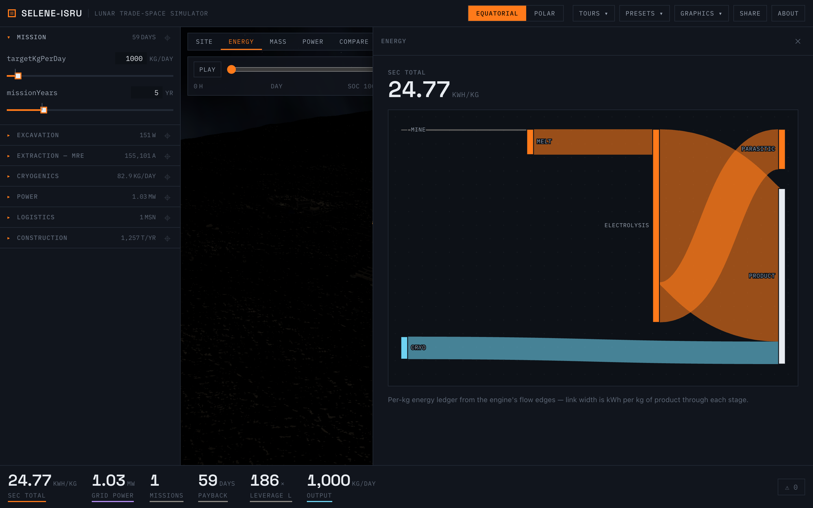
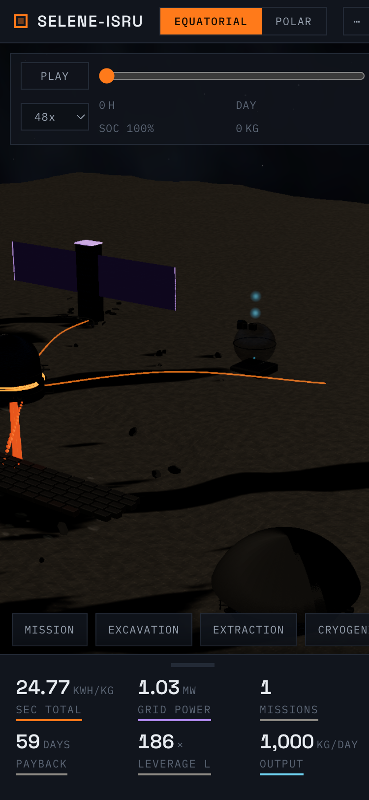

# selene-isru

[](https://github.com/dogum/selene-isru/actions/workflows/ci.yml)
[](LICENSE)

A single-page, client-side engineering trade-space simulator for a
self-sustaining lunar ISRU chain. Move a slider; the entire lunar industrial
chain — 3D diorama, energy Sankey, mass manifest, mission count, payback
clock — recomputes and re-renders the same frame. No server, no debounce,
no workers: the physics engine runs in well under a millisecond.

The renderer uses a hybrid procedural/Blender pipeline. Lunar terrain, regolith
PBR maps, star fields, Earth, environment lighting, and effects are generated
from code at runtime. Hero equipment can be generated reproducibly from
checked-in Blender/Python source, exported as optimized GLB, and driven by live
simulator state. The equatorial site now uses this workflow for the MRE reactor,
excavation fleet, casting yard, cryogenic farm, power hub, landing system, and
surface habitat. The polar site uses the same workflow for its tracked ice
excavator, sublimation camp, beam receiver and Sabatier skid, cryogenic farm,
rim power towers, nuclear station, and occupied habitat.

**Live demo:** [dogum.github.io/selene-isru](https://dogum.github.io/selene-isru/)
(deployed from `main` by GitHub Actions).

| Equatorial MRE plant | Shackleton beamed-power ice camp |
|---|---|
|  |  |

| Energy Sankey | Mobile (stage + bottom sheet) |
|---|---|
|  |  |

## The parity story

Every equation lives twice:

- **TypeScript** (`packages/engine`) — the runtime engine the app calls on
  every input event. Zero dependencies, pure ESM, < 50 kB built.
- **Python** (`python/selene_isru`) — an independent mirror used for
  derivations, citations, and golden-vector generation.

`python/tools/generate_golden.py` Latin-hypercube samples **200 points**
across the full parameter box (plus named corner scenarios), runs the Python
engine, and writes `packages/engine/test/golden_vectors.json`. Vitest then
asserts that the TypeScript engine reproduces **every numeric leaf to 1e-9
relative tolerance**. CI regenerates the vectors from Python on every push —
a unilateral edit to either implementation breaks the build.

## Architecture

```
constants/constants.json ──── single source of truth (values, bounds, units, citations)
        │ codegen                       │ import
        ▼                               ▼
packages/engine (TS)  ◄── parity ──►  python/selene_isru
        │  simulate(params) → SimResult         │
        ▼                                       ▼
packages/app (React + Three.js)         notebooks / golden vectors
  ├─ state/store.ts    zustand: setParam → simulate() → render, URL sync
  ├─ viewer/           vanilla Three.js Viewer class (no react-three-fiber)
  │   ├─ bindings.ts   SimResult → scene contract + graphics tiers (§ tested)
  │   ├─ post.ts       EffectComposer chain: GTAO, bloom, SMAA, output
  │   ├─ textures.ts   generated PBR maps + PMREM environment
  │   └─ dioramas/     equatorial + polar hybrid mission scenes
  └─ components/       control rail, KPI strip, Sankey/Mass/Power panels
assets/blender/         reproducible hero-asset generators + editable .blend source
```

The app consumes **only** the engine's public API (`simulate`, `DEFAULTS`,
`PARAM_META`, and the exported pure helpers) — zero physics re-derivation in
UI code. The starfield, Earth, and terrain/textures remain seeded math; authored
hero equipment includes its generator, editable Blender source, optimized web
asset, and license entry in `assets/ASSET_LICENSES.md`.
The top-bar graphics menu exposes Auto/Low/Medium/High/Ultra tiers, bloom,
the dev HUD, photo mode, and PNG export.

Visual QA and performance notes are recorded in the [MRE vertical slice](docs/vertical-slice-mre.md), the [equatorial equipment overhaul](docs/equatorial-asset-overhaul.md), and the [polar equipment overhaul](docs/polar-asset-overhaul.md).

## Workspace

- `constants/constants.json` — constants, defaults, slider bounds, units, citations.
- `packages/engine` — TS physics engine (frozen public API).
- `packages/app` — React + Three.js frontend (Vite, deployed to Pages).
- `assets/blender` — original Blender/Python source for reproducible 3D assets.
- `python/` — mirror package, pytest suite, derivation notebook, golden generator.
- `docs/screenshots/` — captured via `pnpm screenshots` against a dev server.

## Commands

```bash
pnpm install
pnpm dev                     # app dev server (http://localhost:5173)
pnpm test                    # engine + app vitest suites
pnpm build                   # engine build + app production build
pnpm asset:mre               # regenerate the MRE .blend and optimized GLB
pnpm asset:equatorial        # regenerate the remaining equatorial equipment library
pnpm asset:polar             # regenerate the polar equipment library

# Python mirror (uv creates and manages the project environment)
uv sync --project python --locked --group dev
uv run --project python pytest python/tests
uv run --project python python python/tools/generate_golden.py
```

Run the complete parity, test, lint, and production-build pipeline with
`pnpm run ci`. See [CONTRIBUTING.md](CONTRIBUTING.md) for model-change guidance.

## Engine API

```ts
import { simulate, DEFAULTS, PARAM_META } from "@selene-isru/engine";

const result = simulate({ targetKgPerDay: 1000, site: "equatorial" });
```

All internal model units are SI. Energy Sankey lines are exposed as
`kWhPerKg`, and all out-of-range numeric inputs are clamped to
`constants/constants.json` bounds with a `param-clamped` warning.

Scenarios share via URL — non-default params serialize to a compact query
string (`?site=polar&chiIce=0.03`) that round-trips to an identical
`SimResult` (asserted in tests).
