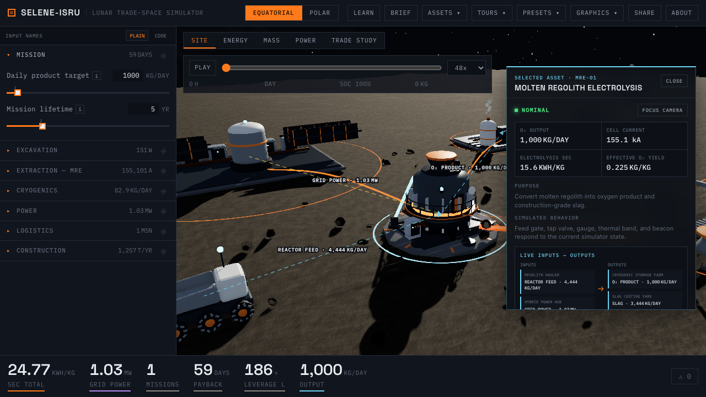
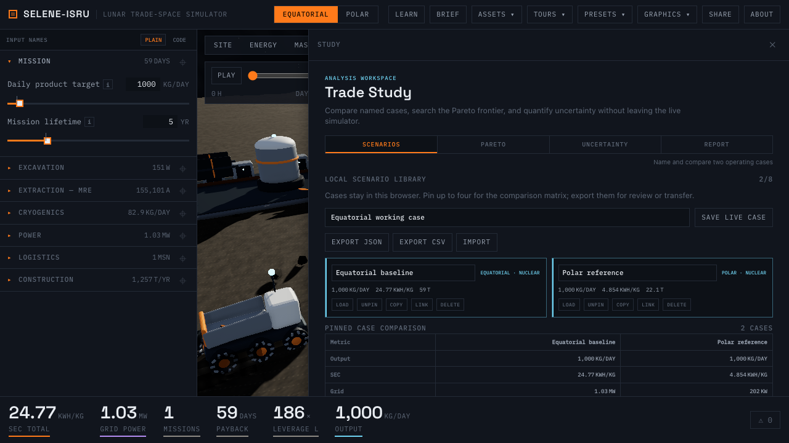
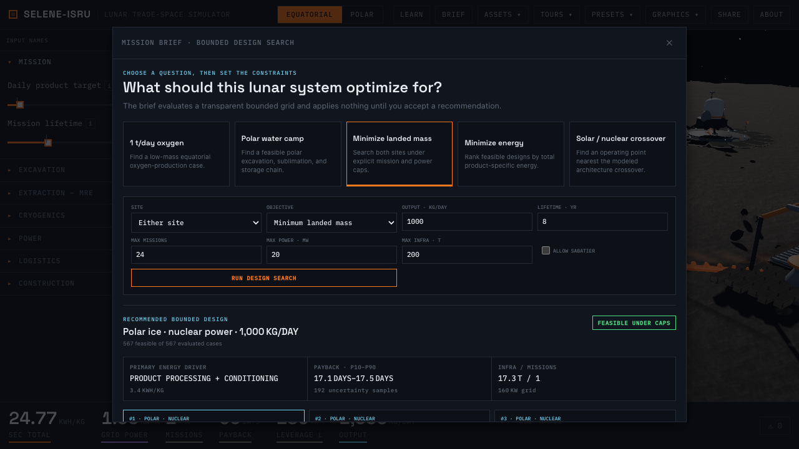
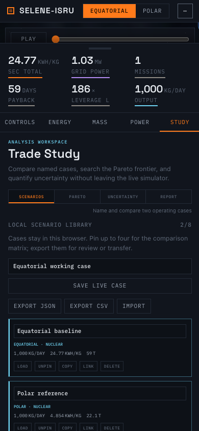

# Analysis and explainability sprint

This sprint turns the simulator's existing engineering depth into an optional,
reviewable workflow without adding permanent clutter to the default diorama.

| Selected live subsystem flow | Named scenario workspace |
|---|---|
|  |  |

| Bounded Mission Brief search | Mobile Trade Study |
|---|---|
|  |  |

## Selected-subsystem explainability

- Selecting equipment isolates only the material and power paths connected to
  that asset, with directional arrows and live throughput labels.
- Connected equipment receives a restrained highlight and can be opened from
  the selected asset's input/output cards.
- The inspector separates purpose from simulated behavior and reports live
  inputs, outputs, operating metrics, the nearest supported bound or active
  warning, assumptions, and model maturity.
- Learn mode remains the place to view the complete process network. Selection
  provides the focused version even when Learn is off.

## Trade Study v2

- A browser-local library stores up to eight named scenarios and persists them
  in `localStorage`.
- Up to four cases can be pinned into a live comparison matrix.
- Each case can be loaded, renamed, duplicated, deleted, or copied as a compact
  reproducibility URL.
- The library imports and exports a versioned JSON format and exports a flat CSV
  containing operating KPIs and reproducibility links.
- The constrained frontier explorer evaluates a deterministic 25 × 25 grid,
  filters engine alarms and user-entered mission/power caps, distinguishes
  infeasible points, and requires an explicit Apply action.
- Uncertainty combines evidence-default relative ranges in 256 deterministic
  Monte Carlo runs and adds one-at-a-time sensitivity ranking for payback,
  specific energy, missions, or infrastructure mass.
- The Report tab produces a print/PDF-ready study snapshot with mission inputs,
  KPIs, uncertainty, energy and mass breakdowns, warnings, caveats, pinned-case
  comparison, and a reproducibility link.

## Mission Brief v2

Mission Brief remains opt-in. Five starting questions populate explicit site,
objective, output, lifetime, mission, power, infrastructure, and Sabatier
constraints. The app evaluates a finite, reproducible engineering grid across
the allowed sites, ranks materially distinct cases, and changes no live state
until the user accepts one. The recommendation includes feasibility, the
primary energy driver, three largest energy drivers, P10–P90 payback, important
caveats, infrastructure mass, missions, and grid power.

This is a bounded search over the simulator model, not a continuous global
optimizer. Reliability, scheduling, crew, spares, and cost risk remain outside
the present model boundary and are stated in the interface and report.

## Evidence and delivery

Input disclosures now include structured model maturity, source URL and source
section, supported-range rationale, applicability, validity limits, and a
default uncertainty. Authoritative public references are linked where they are
available; project-specific assumptions point to the checked-in constants
source.

The Pareto, uncertainty, and report implementations are loaded only when their
tabs are opened. Three.js, React, D3, Zustand, and the app entry are separated
into stable production chunks, while the 3D viewer reports progressive GLB
loading through an unobtrusive live status.

## Reproducible review artifact

With the dev server running, record the browser-driven tour with:

```bash
pnpm demo:analysis -- http://localhost:5173
```

The checked-in output is [analysis-sprint-demo.webm](media/analysis-sprint-demo.webm).
It covers selected MRE flows, Pareto, uncertainty, the engineering report, and
the bounded Mission Brief recommendation in about 18 seconds.

## Build and performance check

The production app was measured through a fresh Chrome context against `vite
preview` on a local Apple Silicon desktop. These are repeatable implementation
checks, not a throttled field-performance claim:

| Check | Desktop · 1280 × 720 | Mobile · 390 × 844 |
|---|---:|---:|
| DOM content loaded | 95 ms | 95 ms |
| First contentful paint | 168 ms | 168 ms |
| Equatorial GLB set ready | 1.68 s | 1.25 s |
| Two-second post-load frame sample | 60 fps | 60 fps |
| Initial compressed JavaScript | 331 kB | 331 kB |
| Initial compressed CSS | 9 kB | 9 kB |
| Equatorial GLBs transferred | 2,818 kB | 2,818 kB |

The app entry fell from approximately 1,115 kB raw / 330 kB gzip before this
sprint to 231 kB raw / 70 kB gzip. Stable React and Three.js vendor chunks keep
the total initial compressed JavaScript essentially neutral at 331 kB, while
the analysis surfaces now load on demand: Pareto 2.62 kB gzip, uncertainty
2.10 kB gzip, and report 2.07 kB gzip.

The LOD audit found that the runtime's large equipment files are unique hero
assets; repeated tanks, panels, and structural details are submeshes inside
those authored GLBs rather than many duplicated scene objects. A useful LOD
implementation therefore requires the Blender generators to export genuine
reduced-detail variants—it would not be responsible to relabel identical
geometry as LOD. With both measured viewports holding 60 fps after load, that
asset-pipeline work is deferred until a device trace identifies a GPU-bound
site or component.

Accessibility QA covered semantic tab/dialog structure, labeled controls,
keyboard-selectable Pareto candidates, an `aria-live` asset-loading indicator,
and Escape dismissal for Photo mode, Mission Brief, and the asset inspector.
The new analysis layouts were also checked for horizontal overflow at 390 px.

The complete `pnpm run ci` pipeline passes: Python regression tests and Ruff,
generated-constant parity, 220 engine tests, 33 app tests, TypeScript checks,
and the production build.
