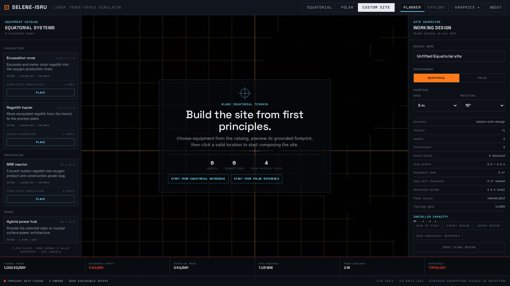
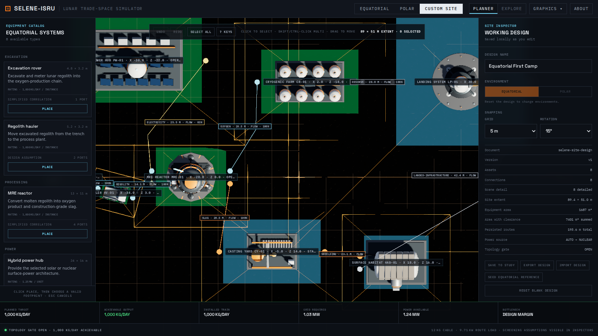
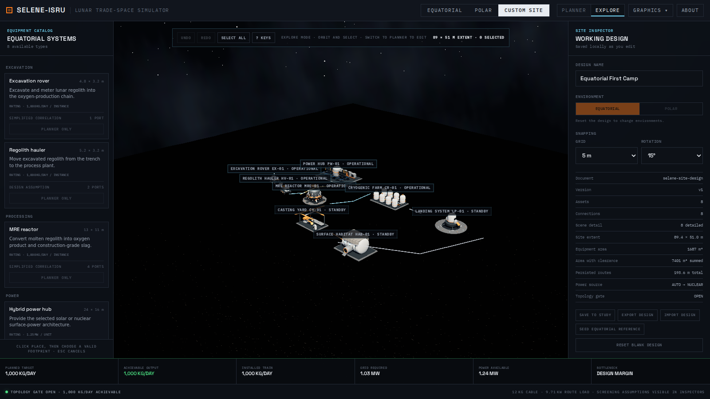
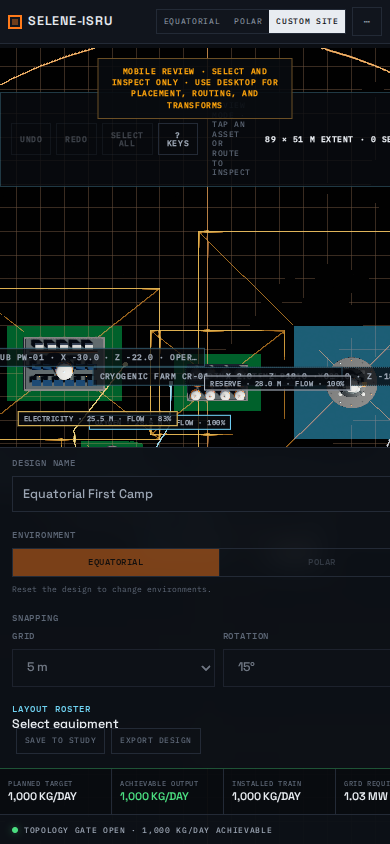

# Custom Site release evidence

This page records the checked-in evidence for the first Custom Site release
candidate. It is a reproducible product and engineering review, not a hardware
qualification or a claim of operational fidelity.

## Review the workflow

[Watch the 24.8-second 1080p demonstration](media/custom-site-sandbox-demo.mp4).
The recording uses the production build with no browser chrome and follows the
same import, evaluation, Planner, and Explore paths exercised by the smoke test.

| Blank starting point | Connected Planner | Saved design in Explore |
|---|---|---|
|  |  |  |

On a narrow viewport, Custom Site explicitly becomes an inspect-only review
surface:



Two versioned, importable designs make the review repeatable:

- [Equatorial First Camp](examples/custom-equatorial-first-camp.v1.json)
- [Shackleton Ice Camp](examples/custom-shackleton-ice-camp.v1.json)

Both samples pass the version-one parser, canonical serialization,
environment/port/graph validation, topology gate, and non-zero evaluation
tests.

## Reproduce it

Build and serve the production app, then provide a local Chrome executable:

```bash
pnpm build
pnpm --filter @selene-isru/app preview --host 127.0.0.1 --port 4173
CHROME_PATH=/path/to/chrome pnpm evidence:custom -- http://127.0.0.1:4173/selene-isru/
```

Use `pnpm smoke:custom -- http://127.0.0.1:4173/selene-isru/` to run the same
assertions without replacing checked-in media. The automated flow:

1. opens a blank Custom Site;
2. places equipment on the canvas;
3. imports a versioned example through findings preview and explicit
   acceptance;
4. confirms a valid topology with non-zero achievable output;
5. renders the same saved document in Planner and Explore;
6. saves the case to the study library and downloads standalone JSON; and
7. verifies the narrow-screen review boundary.

WebGL context recovery is covered by deterministic viewer state-restoration
tests. Deliberate GPU-loss injection is not part of this browser run because
headless SwiftShader does not restore it reliably; that limitation is preserved
in the machine-readable evidence rather than reported as a passing browser
check.

## Measured release sample

The checked-in
[machine-readable result](performance/custom-site-release.json) was captured
on 2026-07-29 in Headless Chrome 151 at 1600×900 using SwiftShader. These
figures establish a repeatable regression baseline; they do not predict
performance on a user's GPU.

| Measure | Result |
|---|---:|
| First canvas placement commit | 348.8 ms |
| Import, validate, evaluate, and render | 513.4 ms |
| Settled animation-frame median / p95 / max, 90 frames | 16.7 / 16.8 / 16.8 ms |
| Settled reference design | 8 assets / 8 connections |
| JavaScript heap / DOM nodes | 19.07 MB / 916 |
| Production JavaScript / CSS | 1,363,316 / 81,032 bytes |
| Mobile review load under SwiftShader | 7,253.4 ms |

Placement and import timings are sampled before screencast recording begins.
Navigation, first WebGL startup, and mobile review are dominated by software
rendering in this environment and remain available in the JSON for regression
comparison.

The deterministic stress fixture separately exercises 160 assets and 159
routes. Rendering keeps all engineering state and selectable footprints while
limiting detailed models to 72 at the default desktop tier and 28 on mobile.

## Model disclosures

Custom Site is a screening compiler over the existing simulation. A saved
document is normalized and validated, its typed graph is compiled into an
effective scenario, then the existing physics engine evaluates the achievable
case. The Custom Site compiler is TypeScript-only; its design graph and spatial
screening terms are not independent Python parity or hardware validation.

### Installed capacity

- One rated process instance represents one complete **1,000 kg/day** baseline
  train. This is a design allocation based on the SELENE v0.1 default target
  and continuously sized subsystem correlations, not a vendor equipment
  rating.
- One configured power-source unit represents **1.25 MW** of nameplate output
  before route loss. This is a screening allocation above the v0.1 default
  equatorial grid point, not a selected flight power system.
- Only enabled assets with their capacity-required ports connected count as
  installed capacity. Unsupported asset kinds remain topology-capable but state
  that quantity scaling is not modeled.

### Power-route screening

Power routes use a level, two-conductor 1.5 kV DC aluminum feeder:

```text
R = 2ρL/A
P_loss = (P_load/V)²R
P_source = P_load + P_loss
m = 2LAρ_m × 1.25
```

The inputs are a 70 mm² conductor area, `ρ = 2.82e-8 Ω·m`, aluminum density
`ρ_m = 2,700 kg/m³`, and a 25% installed-mass allowance. Persisted X/Z route
length drives the calculation. Terrain-following length, voltage conversion,
switchgear, thermal derating, redundancy, protection, and detailed installation
design are excluded.

### Granular-haul screening

Supported granular material routes add rolling-resistance work:

```text
E = m_feed × L × Crr × g_lunar × 9 / η_drive
```

The screening assumptions are `Crr = 0.05` and a loaded-plus-empty round-trip
mass ratio of 9. Grade, trafficability, wheel slip, dispatch queues, fleet
availability, and route conflicts are excluded.

Product, construction, logistics, and unsupported material routes report
measured planning length without inventing a mass, power, or throughput
penalty. Inspectors expose the equation, units, maturity, evidence, and limits
for every applied spatial term.

## Release boundary

Desktop provides the full create → place → connect → validate → evaluate → save
→ export loop. Mobile provides honest selection and inspection, not precision
editing. Planner owns footprints, grid, placement, transforms, and routing;
Explore deliberately limits interaction to camera navigation and selection
while rendering the same persisted document.

The release candidate remains a mission-concept sandbox. Its results are useful
for transparent architecture screening and relative comparisons, not detailed
site engineering, hardware procurement, safety decisions, or mission
certification.
