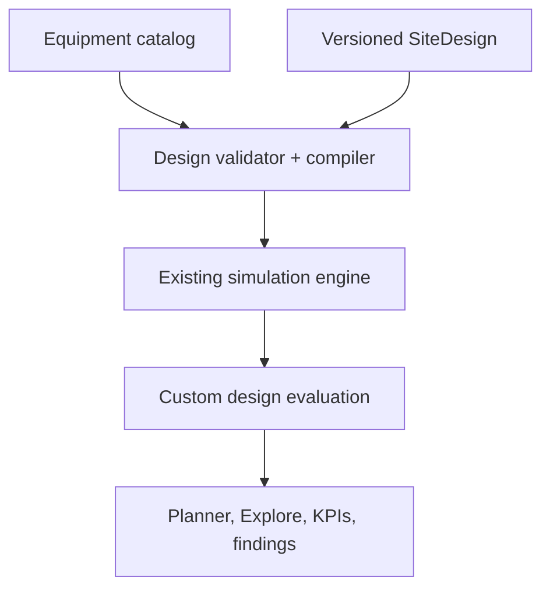

# Custom Site Sandbox — product and implementation specification

| Field | Value |
|---|---|
| Date | 2026-07-28 |
| Working branch | `feature/custom-site-sandbox` |
| Status | Milestones 0–7 implemented; Milestone 8 next |
| Baseline | Merged `main` after PR #1 |

## Outcome

SELENE-ISRU will retain its authored Equatorial and Polar experiences and add a
third workspace option, **Custom Site**, where a user can build, connect,
evaluate, save, and revisit a lunar ISRU installation of their own design.

Custom Site is not a decorative scene arranger. The placed equipment,
connection topology, quantities, configuration, and eventually separation
distances must affect validation and engineering results. The experience should
feel like a serious site-planning sandbox that is still inviting enough for a
new user to begin with a blank lunar surface and discover the system by
building it.

The feature is delivered as a sequence of usable vertical slices. Each
milestone must leave the existing authored sites working and must not present
an incomplete custom design as a valid operating plant.

## Product decisions

The following decisions are part of the baseline contract.

1. **Custom Site is a workspace mode, not a third physical environment.**
   Every custom design chooses an Equatorial or Polar environment. The existing
   `SiteMode` remains `"equatorial" | "polar"` and continues to control the
   environmental physics.
2. **Environment-compatible equipment is enforced initially.** Equatorial
   designs use equatorial and common equipment; Polar designs use polar and
   common equipment. The schema must allow a future explicitly experimental
   mixed-equipment mode without requiring a migration.
3. **The default entry is a blank site.** The user may optionally seed a
   custom design from either authored site, but a template is not required.
4. **Planning and operating are distinct views of the same design.**
   Planner mode emphasizes layout, footprints, ports, distances, and
   connections. Explore mode returns to the cinematic perspective, live
   equipment motion, lighting, inspectors, and simulation results.
5. **Topology is functional.** Missing, disconnected, incompatible, or
   capacity-limited equipment produces explicit validation findings and cannot
   silently report a nominal operating plant.
6. **Geometry uses metres and deterministic terrain grounding.** Persisted
   coordinates are stable world-space design coordinates. Display elevation is
   sampled from the active terrain rather than written into every asset.
7. **The design is portable and reproducible.** A versioned JSON document
   stores the environment, parameters, asset instances, connections, and
   planning metadata. Import must validate before changing live state.
8. **Current authored sites remain curated reference experiences.** Their
   hand-authored composition, tours, camera poses, and performance must not be
   degraded to make the editor possible.
9. **Engineering claims remain bounded.** Spatial penalties, equipment
   ratings, and connection properties must identify their source or state that
   they are design assumptions. Visual completion is not hardware validation.

## Current-state assessment

The feature begins with substantial reusable infrastructure, but the existing
authored scenes are static compositions rather than latent editors.

| Reusable now | New work required |
|---|---|
| Equatorial and Polar terrain generation and grounding | Blank custom terrain runtime |
| Fifteen reproducibly generated equipment GLBs | Shared cached cloning for dynamic instances |
| Canvas raycasting, hover, selection, and focus | Instance-aware picking and transform tools |
| Orbit camera and named authored poses | Orthographic planner camera and view-state handoff |
| Static site asset registries | Versioned equipment catalog |
| Static process-flow edges and learning overlay | Persisted typed ports and user-authored graph |
| `SimParams`, `SimResult`, warnings, and timeseries | Design compiler and installed-site evaluation |
| Zustand state and browser-local scenario library | Custom document, commands, migrations, and recovery |
| JSON study import/export | Versioned custom-design import/export |
| Contextual asset inspectors | Dynamic instance/connection/finding inspector |
| Continuous authored equipment animations | Custom topology-aware operational rendering |

Hard-coded positions in `EquatorialDiorama` and `PolarDiorama`, static
site-specific labels and camera records in `Viewer`, and topology derived from
`processEdges()` cannot simply be made editable. They remain the authored-site
implementation while Custom Site introduces instance-aware contracts beside
them and then consolidates genuinely shared metadata incrementally.

## Product principles

- **Useful before exhaustive.** The first release must support a complete
  design loop even if some equipment capacity models remain screening-level.
- **Model-backed, not performative.** An invalid graph is shown as invalid; the
  UI never hides missing physics behind a polished scene.
- **Creative but controlled.** Users can arrange a site freely while snapping,
  footprints, typed ports, compatibility rules, and validation make intent
  legible.
- **Progressive disclosure.** A new user can place and connect equipment
  without understanding every parameter. Detailed assumptions, port
  properties, and model maturity remain inspectable.
- **Reversible interaction.** Placement, movement, rotation, connection,
  configuration, and deletion are undoable.
- **Deterministic review.** The same design document and engine version produce
  the same normalized topology, findings, and outputs.
- **Operational clarity.** The UI should read as an engineering planning
  workspace rather than a game inventory or a dark science-fiction editor.

## Scope

### Included

- A Custom Site entry point alongside Equatorial and Polar.
- Blank Equatorial and Polar planning terrains.
- An organized catalog of existing SELENE equipment.
- Place, select, move, rotate, duplicate, and delete asset instances.
- Terrain grounding, grid snapping, footprint display, and coordinate readout.
- A top-down 3D planner with scale, distance, and connection overlays.
- Typed material, power, construction, and logistics connections.
- Connection creation, editing, deletion, and validation.
- Live site validation with errors, cautions, and informational findings.
- Compilation of a custom design into the existing simulation plus
  custom-design evaluation results.
- Explicit planned-versus-achievable status when installed equipment or
  topology cannot support the requested target.
- Versioned save, load, duplicate, import, and export.
- Undo/redo and safe recovery after invalid imports or interrupted edits.
- Desktop-first editing and a useful mobile review experience.
- Tests, reference fixtures, screenshots, and performance evidence.

### Deferred

- Simultaneous multi-user editing or cloud collaboration.
- Arbitrary user-uploaded GLB models.
- A general-purpose CAD system or terrain sculpting suite.
- Detailed pipe-network hydraulics, AC/DC power-flow studies, thermal-network
  solvers, discrete-event maintenance, scheduling, or construction sequencing.
- Automatic optimal site generation.
- Free mixing of incompatible Equatorial and Polar equipment in the initial UI.
- Off-world logistics route planning beyond the existing lander model.
- Claims of flight qualification, mission readiness, or location certification.

These are deliberate boundaries, not reasons to make the first sandbox
cosmetic. The initial graph, capacities, and spatial measurements still have
real consequences within the documented screening-model boundary.

## Terminology

| Term | Meaning |
|---|---|
| Authored site | Existing curated Equatorial or Polar scene |
| Environment | Equatorial or Polar physical/site assumptions |
| Custom Site | User-authored equipment layout and topology |
| Design | Persisted custom-site document |
| Asset kind | Catalog definition such as equatorial excavator |
| Asset instance | One placed occurrence of an asset kind |
| Port | Typed connection endpoint on an asset |
| Connection | Directed relationship between two compatible ports |
| Planned target | User-requested production in `SimParams` |
| Achievable output | Output allowed by topology and installed capacity |
| Finding | Deterministic error, caution, or information from validation |
| Planner mode | Top-down editing-oriented 3D view |
| Explore mode | Perspective, operational, cinematic 3D view |

## Core user journey

### Create

1. Select **CUSTOM SITE** from the top-level site/workspace selector.
2. Choose **Equatorial** or **Polar** environment.
3. Choose **Start blank**, **Seed from Equatorial**, or **Seed from Polar**
   where compatible.
4. Enter a design name. A recoverable working draft is created immediately.

### Plan

1. Enter Planner mode automatically on a new blank site.
2. Browse equipment by process category.
3. Select an item and see its footprint, role, compatible environment, ports,
   major rating, and model maturity before placement.
4. Place it on terrain with a ghost preview.
5. Move and rotate it using direct manipulation or numeric fields.
6. Use grid snapping, alignment guides, clearance overlays, and distance
   measurements to organize the site intentionally.
7. Duplicate repeatable equipment or change an explicit installed quantity
   where a catalog item represents a bank rather than a physical unit.

### Connect

1. Activate Connect or select an exposed output port.
2. Compatible destination ports highlight; incompatible ports remain visible
   but explain why they cannot connect.
3. Create a material, power, construction, or logistics route.
4. Inspect route length, direction, stream, status, and applicable assumptions.
5. Move equipment and see routed length and any length-dependent evaluation
   update.

### Configure and evaluate

1. Select equipment to open a custom-site inspector.
2. Change instance settings and relevant shared simulation inputs.
3. Review errors, cautions, bottlenecks, unused equipment, capacity margins,
   planned output, achievable output, grid demand, mass, missions, and
   leverage.
4. Follow a finding to focus the implicated asset, port, connection, or input.
5. Switch to Explore mode to watch the constructed plant operate.

### Save, compare, and share

1. Rename or duplicate the design.
2. Save a named snapshot into the scenario library.
3. Compare supported custom designs using the existing study workspace.
4. Export canonical JSON for review or transfer.
5. Re-import safely; validation occurs before the active design is replaced.

## Experience architecture

### Top-level selection

The top bar becomes a three-option workspace selector:

- **EQUATORIAL**
- **POLAR**
- **CUSTOM SITE**

Equatorial and Polar continue to open their authored sites. Custom Site opens
the last working custom design or the creation flow. Inside Custom Site, the
environment remains visible and editable through design settings until
environment-specific equipment has been placed. Changing environment after
placement requires an explicit migration review.

### Custom Site desktop layout

The desktop workspace uses five coordinated regions without permanently
obscuring the scene:

| Region | Purpose |
|---|---|
| Top bar | Workspace, design name, environment, Planner/Explore, save/export |
| Left catalog | Searchable equipment categories and placement tools |
| Central viewport | 3D planner or operational scene |
| Right inspector | Selected asset, connection, site settings, or validation |
| Bottom status | KPIs, validity, bottleneck, coordinates, scale, undo/redo |

Panels should be collapsible. Closing both side panels gives the viewport the
full stage without leaving editing mode.

### Planner mode

Planner mode remains Three.js and uses the same physical scene, asset geometry,
terrain sampler, and selection model. It changes camera, rendering emphasis,
and interaction behavior.

#### Camera

- Orthographic camera by default, aligned near vertically over the site.
- Optional small tilt, no more than approximately 15 degrees, to retain height
  and equipment readability without compromising placement accuracy.
- Smooth transition between Planner and Explore cameras.
- Independent planner zoom and explore camera bookmark.
- Fit all, fit selection, and return-to-origin controls.
- North/axis indicator and metre scale remain visible.
- Rotation of the planner camera is deliberate and resettable; the design's
  coordinates never rotate with the camera.

#### Planning surface

- World units are metres.
- Major grid defaults to 10 m; minor grid defaults to 1 m.
- Snap options: off, 1 m, 5 m, and 10 m.
- Rotation snap options: off, 5°, 15°, 45°, and 90°.
- Grid fades with zoom and does not contaminate Explore mode.
- Cursor readout shows X/Z position and sampled terrain elevation.
- A footprint preview follows the pointer before placement.
- Invalid placement uses a clear blocked state and a specific explanation.

#### Intent and organization

- Bounding footprints are catalog data, not inferred from visual mesh bounds
  on every frame.
- Optional clearance envelopes show maintenance, thermal, plume, or safety
  standoff where defined.
- Alignment guides appear between nearby asset centres and footprint edges.
- A measurement tool supports point-to-point distance and remains non-mutating.
- Selecting two assets reports centre distance, nearest-footprint distance,
  and connected route length where applicable.
- A compact site summary reports occupied area and maximum site span without
  claiming detailed land-use optimization.
- Optional named zones may be added after the core editor is stable. Initial
  zones are annotations and do not affect physics.

#### Direct manipulation

- Click selects; `Shift` adds to selection after multi-select is implemented.
- Dragging a selected transform handle moves the asset on the terrain plane.
- Rotation uses a visible ring or a dedicated rotate tool.
- Orbit/pan controls are suspended while a transform handle is active.
- `Escape` cancels placement or the active uncommitted connection.
- `Delete`/`Backspace` requests deletion and remains undoable.
- Arrow-key nudging uses the current snap increment.
- Numeric X, Z, and heading fields provide an accessible precise alternative.

The editor must distinguish camera drag from asset drag. A small pointer-motion
threshold alone is insufficient; transform handles and explicit tool state own
the gesture.

### Explore mode

Explore mode uses the existing perspective camera, lighting, time controls,
selection treatment, learning overlays, and live equipment behavior where they
apply. It adds:

- Camera framing based on the custom design bounds.
- Dynamic asset labels from catalog and instance names.
- Custom connections rendered from the persisted topology.
- Focus-camera poses derived from asset bounds rather than static authored
  coordinates.
- A return-to-planner action that preserves selection.
- A clear indication when the visible design is incomplete or non-operational.

## Equipment catalog

The initial catalog reuses the existing reproducibly generated GLBs.

### Equatorial

- Excavation rover
- Regolith hauler
- MRE reactor
- Slag casting yard
- Cryogenic storage farm
- Hybrid power hub
- Landing system
- Surface habitat

### Polar

- Polar ice excavator
- Sublimation field camp
- Receiver and Sabatier plant
- Polar cryogenic farm
- Rim power towers
- Polar nuclear station
- Polar habitat

### Common logical entries

Logical entries may initially reuse an existing visual system:

- Site grid/interconnect
- Material transfer route
- Power route
- Construction/logistics route
- Measurement or planning annotation

Each catalog definition must declare:

- Stable kind identifier and schema version.
- User-facing name, category, purpose, and model maturity.
- Compatible environments.
- GLB/model factory and fallback representation.
- Physical footprint and optional clearance envelope.
- Default heading and placement constraints.
- Whether multiple instances are allowed.
- Ports with direction, kind, stream compatibility, and multiplicity.
- Relevant global and instance-level controls.
- Capacity or rating model when available.
- Mass model or explicit statement that mass remains continuously sized.
- Camera/label anchor hints.
- Evidence and assumptions for engineering properties.

## Persisted data contract

The design graph is separate from `SimParams`. Structural state must not be
encoded into more flat URL parameters.

```ts
type WorkspaceMode = "authored" | "custom";
type SiteEnvironment = "equatorial" | "polar";
type SiteViewMode = "planner" | "explore";
type ConnectionKind = "material" | "power" | "construction" | "logistics";

interface SiteDesignDocument {
  schema: "selene-site-design";
  version: 1;
  id: string;
  name: string;
  environment: SiteEnvironment;
  params: SimParams;
  assets: SiteAssetInstance[];
  connections: SiteConnection[];
  planner: PlannerDocumentState;
  createdAt: string;
  updatedAt: string;
  appVersion?: string;
}

interface SiteAssetInstance {
  id: string;
  kind: string;
  name: string;
  transform: {
    xM: number;
    zM: number;
    headingDeg: number;
  };
  enabled: boolean;
  configuration: Record<string, number | string | boolean>;
}

interface SitePortRef {
  assetId: string;
  portId: string;
}

interface SiteConnection {
  id: string;
  kind: ConnectionKind;
  from: SitePortRef;
  to: SitePortRef;
  route: Array<{ xM: number; zM: number }>;
  configuration: Record<string, number | string | boolean>;
}

interface PlannerDocumentState {
  gridSnapM: 0 | 1 | 5 | 10;
  rotationSnapDeg: 0 | 5 | 15 | 45 | 90;
  northDeg: number;
  annotations: SiteAnnotation[];
}
```

Camera position, open panels, hover, active tool, draft connection, selection,
and undo history are session state, not core engineering document state.

### Identity and ordering

- IDs are opaque and stable for the lifetime of the design.
- Export arrays are sorted deterministically by ID.
- Connection direction is explicit.
- Names are presentation metadata and are not used as identity.
- Coordinates and headings are normalized on import.
- Unknown catalog kinds are preserved as unresolved placeholders when safe so
  a newer document is not destructively rewritten by an older app.

### Scenario-library compatibility

The existing `StudyScenario` remains backward compatible by adding an optional
design:

```ts
interface StudyScenario {
  // existing fields
  params: SimParams;
  design?: SiteDesignDocument;
}
```

Parametric authored cases continue to work without `design`. Custom snapshots
carry both `params` and `design`. Study export receives a new version and its
migration accepts the existing version without data loss.

## Catalog and runtime contracts

Catalog data is an explicit registry rather than additional conditionals spread
across `Viewer`, `AssetInspector`, and the two authored dioramas.

```ts
interface SiteAssetDefinition {
  kind: string;
  label: string;
  category: string;
  compatibleEnvironments: SiteEnvironment[];
  footprint: FootprintDefinition;
  clearance?: ClearanceDefinition[];
  ports: SitePortDefinition[];
  multiplicity: "single" | "multiple";
  model: SiteAssetModelBinding;
  createVisual: AssetVisualFactory;
}

interface SitePortDefinition {
  id: string;
  label: string;
  kind: ConnectionKind;
  direction: "input" | "output" | "bidirectional";
  streams: string[];
  maxConnections?: number;
  localAnchorM: readonly [number, number, number];
}
```

The authored dioramas may continue using their specialized animation classes.
The custom runtime reuses their asset wrappers through a shared asset loader
and catalog. Refactoring must avoid duplicating GLB URL, label, port, and
knowledge metadata.

## Topology and validation

Validation is deterministic and separated from React and Three.js.

### Validation stages

1. **Schema validation**
   - Supported document version.
   - Finite coordinates and bounded text/configuration sizes.
   - Unique asset and connection IDs.
2. **Catalog resolution**
   - Every kind resolves or becomes an explicit unresolved placeholder.
   - Asset/environment compatibility.
3. **Placement validation**
   - Within supported planning bounds.
   - Footprint collision and defined clearance conflicts.
   - Terrain/plume/receiver constraints where the catalog defines them.
4. **Port validation**
   - Referenced asset and port exist.
   - Direction, kind, and stream are compatible.
   - Port connection-count limits are obeyed.
5. **Graph validation**
   - Required process chain exists for the environment and active options.
   - Powered consumers have a reachable active source.
   - Product reaches compatible storage or use.
   - Orphaned and unused assets are reported.
   - Unsupported cycles and ambiguous sources are reported.
6. **Capacity validation**
   - Installed ratings are compared with process demand.
   - Bottleneck, margin, planned target, and achievable output are identified.
7. **Model-boundary validation**
   - Unsupported equipment combinations or unmodeled connection effects are
     disclosed rather than silently ignored.

### Finding severity

| Severity | Meaning | Simulation behavior |
|---|---|---|
| Error | Design cannot represent an operating plant | Achievable output is zero or explicitly unavailable |
| Caution | Design can run but violates a recommended margin or relies on a weak assumption | Outputs remain available with warning |
| Information | Unused asset, normalization, or model-boundary disclosure | No automatic penalty |

Every finding includes a stable ID, message, severity, affected entity IDs,
evidence/model-maturity label, and optional suggested action. Clicking a
finding focuses the affected object or connection.

## Design compilation and simulation integration

The custom design compiler is a pure engine-side function:

```ts
interface SiteDesignEvaluation {
  normalizedDesign: SiteDesignDocument;
  effectiveParams: SimParams;
  baseResult: SimResult | null;
  plannedTargetKgPerDay: number;
  achievableOutputKgPerDay: number;
  bottleneck: SiteBottleneck | null;
  assetEvaluations: SiteAssetEvaluation[];
  connectionEvaluations: SiteConnectionEvaluation[];
  findings: SiteDesignFinding[];
}

function evaluateSiteDesign(design: SiteDesignDocument): SiteDesignEvaluation;
```

### Phased model behavior

#### Topology gate

The first model-backed slice uses topology as a hard gate. A required broken
chain cannot claim nominal output. The existing `simulate()` result may still
be shown as **required continuous design** for diagnostic comparison, but it is
not labeled as achieved site performance.

#### Installed capacity

Catalog ratings add installed-capacity checks. The engine retains its current
per-unit process equations and continuous sizing while the custom evaluator
compares required duty against installed equipment. Repeatable equipment
instances increase installed capacity where the model supports it.

The UI distinguishes:

- Requested production.
- Continuously sized requirement from the existing model.
- Installed custom capacity.
- Achievable production.
- Capacity margin and limiting asset.

Ratings that are not yet defensible remain unavailable rather than receiving
invented precision. An asset without a capacity model can satisfy topology but
must disclose that quantity has not yet changed capacity.

#### Spatial consequences

Planner distances become engineering inputs incrementally:

1. Route and separation lengths are measured and persisted immediately.
2. Connection summaries expose length even before a penalty model exists.
3. Power routes add documented cable mass and loss assumptions.
4. Material routes add the appropriate pipe, conveyor, or haul-distance
   implication when a supported transport model exists.
5. Logistics and construction routes may add distance effects only after their
   duty model is explicit.

Spatial calculations use the persisted route polyline, not screen distance.
The first implementation may use X/Z route length; terrain-following length is
added only when the difference is calculated consistently. Every applied
penalty reports its equation and assumption.

### Power selection

The existing model chooses the lower-mass solar or nuclear architecture. A
custom site makes installed power explicit. The workstream adds a parameter or
design override equivalent to:

```ts
type PowerStrategy = "auto" | "solar" | "nuclear";
```

Authored sites retain `auto`. A custom graph containing only a supported solar
or nuclear source selects that architecture. Contradictory installed sources
require an explicit hybrid/backup interpretation before both can contribute.

## State management

Zustand remains the React-side state manager, but custom editing is separated
into:

- **Document state:** persisted `SiteDesignDocument`.
- **Evaluation state:** pure derived `SiteDesignEvaluation`.
- **Editor session:** tool, selection, hover, panel, camera, draft operation.
- **History state:** bounded undo/redo commands.

The current `params/result/timeseries` state remains authoritative for authored
sites. Custom mode adds the design and evaluation without making Three.js
objects part of Zustand state.

### Undo/redo

Commands cover:

- Place asset.
- Move or rotate one or more assets.
- Change instance configuration.
- Create, edit, or delete connection.
- Delete or duplicate assets.
- Batch migration such as environment change.

Continuous pointer movement coalesces into one command on pointer release.
History is bounded by count and estimated memory. Import/load creates a new
history root rather than thousands of commands.

## Persistence, import, and recovery

- The active working design is autosaved locally after a short debounce.
- Named custom designs use the scenario library and its existing count limits
  until a measured need justifies expansion.
- Import parses and validates into temporary state before replacing the active
  document.
- Invalid imports show all actionable findings and leave the current design
  untouched.
- Export uses canonical JSON with schema and version.
- A normalized imported design is not silently saved over the source; the user
  explicitly accepts migration.
- Future migrations are pure, sequential functions with fixture coverage.
- A recoverable prior autosave is retained until the new save completes.

The initial custom design is too large for the current compact parameter URL.
JSON is the authoritative sharing format. A compressed share URL is a later
enhancement with explicit size limits.

## Rendering architecture

### Separation of responsibilities

- `Viewer` continues to own renderer, cameras, controls, picking, and frame
  lifecycle.
- Authored `EquatorialDiorama` and `PolarDiorama` retain curated composition.
- A new `CustomSiteDiorama` or equivalent owns dynamic instances and connection
  geometry.
- A focused editor controller owns planner tools, transform controls, terrain
  raycasting, and placement previews.
- React owns catalogs, inspectors, commands, and document state.

### Asset loading

- GLB scenes are loaded once per asset kind and cloned for instances.
- Shared materials and geometry are disposed only when no runtime user remains.
- Loading and failure state is tracked per kind.
- A failed GLB displays a bounded placeholder with the correct footprint,
  label, ports, and selection behavior.
- Large catalogs remain lazy by environment and category.

### Picking and selection

The current static `assetKey` approach becomes instance-aware:

- `assetId` identifies a placed instance.
- `kind` resolves catalog behavior.
- Custom labels and inspectors use catalog plus instance data.
- Dynamic focus poses derive from bounding boxes.
- Connections receive their own pickable hit targets.

### Connections

- Planner connections are readable tubes/lines or screen-space overlays with
  port anchors and route handles.
- Explore connections use restrained site-appropriate geometry and can be
  hidden without deleting topology.
- Direction and kind remain distinguishable without relying on color alone.
- Long routes and crossing routes remain legible at planner zoom.
- Connection geometry updates during drag without re-running the full engine
  on every pointer event; evaluation runs at a bounded cadence and on commit.

## Inspector behavior

The right inspector adapts to selection.

### No selection

- Design name and environment.
- Planned target and current validity.
- Asset/connection counts.
- Primary bottleneck or next required step.
- Start validation review.

### Asset selection

- Instance name and catalog role.
- Position, heading, footprint, and clearances.
- Connected and unconnected ports.
- Installed rating, required duty, and margin where available.
- Relevant controls and live model outputs.
- Assumptions, evidence, and maturity.
- Duplicate, disable, focus, and delete.

### Connection selection

- Kind, stream, direction, and endpoints.
- Route length and editable route points.
- Applied loss/mass/transport model when available.
- Capacity/utilization and compatibility.
- Assumptions and findings.

### Finding selection

- Explanation and severity.
- Affected entities.
- Why it matters.
- Suggested corrective action.
- Focus and, when safe, one-click repair such as removing a dangling
  connection. Automatic repair never inserts equipment without confirmation.

## Mobile behavior

Full freeform authoring is desktop-first because precise 3D placement and route
editing require space. Mobile must still support:

- Open and inspect a custom design.
- Switch Planner/Explore.
- Pan/zoom the planner.
- Select assets and connections.
- Review validation and KPIs.
- Change safe numeric parameters.
- Export or duplicate a design.

Initial mobile may omit direct placement, multi-select, and route-handle
editing. The UI must state **review mode** rather than presenting disabled
controls without explanation.

## Accessibility and input

- Every pointer action has a keyboard/numeric alternative.
- Catalog items and inspector controls use semantic buttons, lists, labels, and
  form elements.
- Planner canvas has concise instructions and announces committed actions and
  validation changes through restrained live regions.
- Color is not the only indicator for connection kind, selection, or severity.
- Focus is preserved when panels open and returns sensibly when they close.
- Reduced-motion mode eliminates animated camera transitions and continuous
  equipment motion without disabling editing.
- Undo/redo shortcuts follow platform conventions.
- Touch targets meet the existing mobile control standard.

## Architecture flow



The design compiler and validator belong outside the rendering layer. Three.js
visual state never determines engineering truth.

## Recommended code boundaries

The exact filenames may evolve during implementation, but the following module
boundaries should remain recognizable.

| Area | Recommended responsibility |
|---|---|
| `packages/engine/src/site-design/types.ts` | Persisted and evaluated design types |
| `packages/engine/src/site-design/catalog.ts` | Engine-facing catalog metadata and port contracts |
| `packages/engine/src/site-design/schema.ts` | Parse, normalize, migrate, and serialize |
| `packages/engine/src/site-design/validate.ts` | Pure schema, placement, port, and graph validation |
| `packages/engine/src/site-design/evaluate.ts` | Topology gate, capacity, bottleneck, and spatial evaluation |
| `packages/app/src/site-design/catalog.ts` | Visual factories and UI metadata paired to stable catalog kinds |
| `packages/app/src/state/store.ts` | Workspace/document/evaluation integration and commands |
| `packages/app/src/viewer/dioramas/custom.ts` | Dynamic custom-site scene representation |
| `packages/app/src/viewer/editor/` | Planner camera, tools, transforms, raycasting, and route handles |
| `packages/app/src/components/site-design/` | Creation flow, catalog, inspector, findings, and planner controls |
| `packages/engine/test/site-design/` | Contract, validation, compilation, and migration fixtures |
| `packages/app/test/site-design/` | State, commands, import safety, and component behavior |

The engine catalog must not import Three.js or GLB URLs. The app catalog may
augment the same stable kinds with rendering factories and presentation
metadata. A test should assert that every engine catalog kind required by the
initial UI has one app visual registration.

The current site-specific asset labels, camera targets, inspector configuration,
and process edges are distributed across several static records. Custom Site
should move shared knowledge into the catalog incrementally while leaving
authored-site behavior stable. A large one-time rewrite of both authored
dioramas is not a prerequisite.

### Runtime invariants

- Persisted design state contains no `THREE.Object3D`, geometry, material,
  texture, camera, or DOM references.
- Rendering caches contain no authoritative engineering values.
- Evaluation is pure for the same design, catalog version, and engine version.
- Catalog kinds and port IDs are stable public document identifiers.
- Committed edits update document state before derived rendering/evaluation.
- Draft pointer movement may update preview geometry without creating history
  entries or autosaves.
- The active custom document is never replaced until parse, migration, and
  validation complete.
- Authored-site code paths do not require a custom document.

## Milestone workstream

### Milestone 0 — contracts and reference fixtures

**Goal:** establish stable types and behavior before UI expansion.

Deliver:

- `SiteDesignDocument`, catalog, port, connection, finding, and evaluation
  types.
- Version-one parser, normalizer, and canonical serializer.
- Initial catalog entries for all existing equipment.
- Blank Equatorial and Polar fixtures.
- Seeded fixtures matching both authored site topologies.
- Pure schema, compatibility, port, and graph validators.
- Documented model-boundary behavior for missing capacity ratings.

Acceptance:

- Fixtures round-trip without structural drift.
- Invalid IDs, coordinates, ports, environments, and connection directions
  produce stable findings.
- Existing `SimParams`, URLs, presets, and study exports still load.
- No editor UI is required to prove the contracts.

### Milestone 1 — Custom Site shell and planner camera

**Goal:** enter a blank custom workspace and navigate it intentionally.

Deliver:

- Custom Site top-level option and environment creation flow.
- Blank terrain using existing deterministic samplers.
- Planner and Explore view modes.
- Orthographic planner camera, grid, scale, axes, fit-all, and fit-selection.
- Collapsible catalog and inspector shells.
- Custom document state and autosave draft.

Acceptance:

- Switching among authored and custom modes does not lose state.
- Planner coordinates remain stable across camera rotation and mode changes.
- Blank sites reload correctly.
- Existing authored-site screenshots and interactions remain unchanged.

### Milestone 2 — placement and transforms

**Goal:** create and organize a site from the asset catalog.

**Implementation status (2026-07-28):** Delivered on the working branch as a
reviewable vertical slice. Typed connections remain intentionally deferred to
Milestone 3, and custom-site evaluation remains deferred to Milestone 4.

Deliver:

- Environment-filtered catalog.
- Placement ghost and footprint.
- Terrain raycast and grounding.
- Select, move, rotate, duplicate, disable, and delete.
- Grid/rotation snapping and numeric transform fields.
- Collision and planning-bound findings.
- Dynamic custom asset labels, picking, focus, and inspector.
- Bounded undo/redo for asset commands.

Acceptance:

- Every catalog asset can be placed, selected, moved, rotated, duplicated where
  allowed, saved, reloaded, and undone.
- Camera gestures cannot accidentally transform equipment.
- Repeated load/remove cycles do not leak scene objects or GL resources.
- Coordinates and headings survive export/import within normalization
  tolerance.

### Milestone 3 — ports, connections, and graph validation

**Goal:** turn a layout into a process topology.

**Implementation status (2026-07-28):** Delivered on the working branch.
Planner ports expose typed connection contracts, compatible targets highlight
during authoring, persisted orthogonal routes remain attached as assets move,
and the inspector reports live route length and graph findings. These
connections are structural only until Milestone 4 makes topology gate custom
simulation output.

Deliver:

- Visible ports in Planner mode.
- Compatible-port highlighting.
- Create, route, inspect, edit, and delete connections.
- Material, power, construction, and logistics connection styles.
- Port and graph validators.
- Findings dock with focus navigation.
- Measured route and inter-asset distances.
- Connection undo/redo and persistence.

Acceptance:

- Valid Equatorial and Polar chains can be assembled from blank fixtures.
- Invalid directions, kinds, streams, multiplicity, dangling endpoints, and
  required-chain gaps are detected.
- Moving an asset updates connected geometry and measured length.
- An invalid graph never displays itself as operational.

### Milestone 4 — topology-backed simulation

**Goal:** make the graph control whether the site can operate.

**Implementation status (2026-07-29):** Delivered on the working branch.
Custom-site evaluation is now a pure engine operation: the persisted graph
selects the connected power strategy, gates achievable output and timeseries
behavior, and produces asset, connection, bottleneck, and warning state for the
planner and process overlays. The planner distinguishes requested production,
the continuously sized required grid, the interpreted installed source, and
achievable production. Equipment quantity ratings, installed capacity margins,
and distance-dependent penalties remain explicitly deferred to Milestone 5.

Deliver:

- Pure `evaluateSiteDesign()`.
- Topology gate and planned-versus-achievable output.
- Design-aware timeseries behavior.
- Installed power-source interpretation and explicit power strategy.
- Custom process-flow overlays driven by persisted connections.
- Design findings integrated with existing warnings and inspectors.
- Existing KPI strip adapted to distinguish required, installed, and achieved.

Acceptance:

- Breaking a required connection changes validity and achievable output.
- Repairing it restores deterministic evaluation.
- Authored sites produce the same results as before.
- Evaluation contains no dependency on Three.js objects or screen state.

### Milestone 5 — installed capacities and spatial consequences

**Goal:** make quantity and organization matter within supported models.

**Implementation status (2026-07-29):** Delivered on the working branch as a
bounded screening model. Rated process instances represent 1,000 kg/day
baseline trains; bank-configured power sources represent 1.25 MW per installed
unit. The evaluator now reports required, installed, available, margin,
utilization, capacity-limited achievable output, and the limiting stage.
Persisted power routes apply a disclosed 1.5 kV DC aluminum-feeder mass/loss
model, and granular feed routes apply a lunar rolling-resistance haul term.
Those contributions flow into achieved grid load, the landed mass manifest,
mission count, throughput-days, and leverage. Product, construction, and
logistics routes remain explicitly measured-only until route-specific duty
models are defensible; X/Z length remains a planning approximation rather than
terrain-following cable or traverse length.

Deliver:

- Traceable catalog ratings for supported repeatable equipment.
- Required duty, installed capacity, margin, and bottleneck calculations.
- Supported quantity scaling for excavation, processing, storage, and power.
- Power-route cable length/mass/loss model with disclosed voltage and conductor
  assumptions.
- Supported material-route distance model where a defensible transport
  representation exists.
- Connection and asset utilization visualization.
- Spatial contribution in mass, power, logistics, and leverage reporting.

Acceptance:

- Adding/removing a rated instance changes installed capacity predictably.
- Moving connected equipment changes only the supported length-dependent terms.
- Every spatial penalty identifies its equation, units, evidence, and limits.
- Unsupported connection kinds state that length is measured but not yet
  penalized.

### Milestone 6 — durable project workflow

**Goal:** make custom designs dependable working artifacts.

**Implementation status (2026-07-29):** Delivered on the working branch.
Custom designs are first-class versioned cases in the local scenario library,
including load, rename, duplicate, delete, pin, comparison, standalone design
export, and version 2 study export. Version 1 study files migrate to authored
cases. Both study and standalone design imports now stop at a findings preview
until the user explicitly accepts them; unsupported documents leave the live
project untouched. Autosave maintains a last-known-valid backup, canonical
serialization makes design files deterministic, and the blank/seeded engine
fixtures serve as representative round-trip examples. Project parameters,
name, environment clearing, reset, asset/configuration edits, planner snaps,
and connection commands all participate in the bounded undo/redo history.
Custom achieved results now flow through the scenario matrix, CSV export, and
engineering report rather than being recomputed as authored parameter-only
cases.

Deliver:

- Named custom designs in the scenario library.
- Save, duplicate, rename, delete, import, and export.
- Study-export migration and custom-design comparison.
- Import preview with findings and explicit acceptance.
- Autosave recovery and corruption fallback.
- Canonical JSON and representative examples.
- Full undo/redo command coverage.

Acceptance:

- A design can be created, closed, reopened, exported, imported into a clean
  browser, and evaluated identically.
- Existing scenario-library exports remain importable.
- Failed import never destroys the current design.
- Duplicate IDs and future unknown catalog kinds are handled safely.

### Milestone 7 — planner depth and operational polish

**Goal:** make planning feel deliberate, creative, and readable at site scale.

**Implementation status (2026-07-29):** Delivered on the working branch.
Planner mode now exposes catalog clearances, collision/clearance coloring,
centerline alignment guides, selected-group bounds, coordinate labels, site
extent, summed equipment/clearance area, and total persisted route length.
Shift/control-click and the layout roster build multi-selections; groups move
as a unit, rotate about their centroid, distribute on X or Z, focus, delete,
and remain one undoable command. Selected routes expose draggable 3D bend
handles plus numeric add/edit/remove controls, while route-kind elevation and
labels keep crossings legible. Blank projects can seed fresh editable copies
of either authored reference layout. Planner and Explore cameras frame the
actual saved extent, group and asset focus use selection scale, and the
shortcut card documents keyboard operations. At mobile breakpoints the same
document is available as an explicit select-and-inspect review surface:
catalog placement, transforms, route editing, and destructive project controls
are unavailable, while metrics and design inspection remain visible.

Deliver:

- Alignment guides, clearances, measurements, and multi-select.
- Group move/rotate and distribution tools where useful.
- Connection route handles and legible crossing treatment.
- Site extent and occupied-footprint summary.
- Better custom Explore framing and custom asset camera focus.
- Seed-from-authored workflows.
- Planner/Explore transition polish and keyboard shortcut reference.
- Mobile review mode.

Acceptance:

- Users can reproduce a supplied reference layout from dimensions without
  fighting the camera.
- Dense designs remain understandable in Planner mode.
- Explore mode accurately reflects the saved design and connection visibility.
- Mobile never suggests unsupported precision editing.

### Milestone 8 — resilience, scale, and accessibility

**Goal:** harden the editor before broad release.

Deliver:

- Performance guardrails and graceful catalog/asset-load failures.
- Large-design stress fixtures.
- WebGL context-loss recovery with custom document restoration.
- Keyboard-only planner review and numeric editing.
- Screen-reader labeling and non-color connection/severity treatments.
- Reduced-motion behavior.
- Touch review QA.
- Error boundaries and actionable recovery states.

Acceptance:

- Reference stress design remains within agreed interaction and memory budgets.
- Context loss does not lose the saved design.
- Missing GLB assets retain selectable placeholders and valid engineering state.
- Critical workflows pass keyboard and screen-reader-oriented review.

### Milestone 9 — release evidence and review

**Goal:** produce a reviewable release candidate with bounded claims.

Deliver:

- Updated README and in-app help.
- Versioned sample custom designs.
- Before/after and Planner/Explore screenshots.
- A short reproducible custom-site demonstration.
- Model and evidence disclosures for new capacity/spatial terms.
- Performance measurements on desktop and mobile review.
- Full CI, browser smoke tests, and migration fixtures.

Acceptance:

- A new user can complete the full create → place → connect → validate →
  evaluate → save → export loop without hidden setup.
- Every global acceptance criterion below passes.
- Known model limits are visible in the product and documentation.

## Dependency order

| Dependency | Required before |
|---|---|
| Versioned design and catalog | Dynamic rendering or persistence |
| Dynamic instances and picking | Connections |
| Typed ports and graph validator | Topology-backed simulation |
| Topology-backed simulation | Installed-capacity claims |
| Measured persisted routes | Spatial penalties |
| Stable document migrations | Broader scenario-library integration |
| Complete desktop loop | Mobile review and release polish |

Milestones may be delivered in smaller pull requests, but their dependency order
should not be inverted to create impressive visuals before engineering truth.

## Testing and evidence plan

### Engine/unit

- Schema normalization and migration fixtures.
- Catalog completeness and unique identifier checks.
- Port compatibility matrix.
- Required-chain detection for both environments.
- Graph cycles, orphans, duplicates, and dangling references.
- Topology gate and achievable-output behavior.
- Capacity and bottleneck calculations.
- Route-length and spatial-penalty unit tests.
- Determinism and canonical serialization.
- Existing parity and conservation suites remain green.

### State/component

- Custom/authored workspace transitions.
- Command coalescing and bounded undo/redo.
- Import preview and failure preservation.
- Scenario-library backward compatibility.
- Catalog filtering and inspector selection.
- Finding-to-entity focus.
- Keyboard/numeric transform alternatives.

### Browser

- Blank-site creation.
- Place/move/rotate/duplicate/delete.
- Connect and repair an invalid chain.
- Planner/Explore round trip.
- Save/reload/export/import.
- WebGL loss/recovery.
- GLB failure placeholder.
- Desktop editing and mobile review.
- Reduced motion and keyboard traversal.

### Visual

- Planner grid and scale at multiple zoom levels.
- Placement ghost, footprint, clearances, and invalid state.
- All connection kinds and crossing cases.
- Dense reference layout.
- Explore framing of small and large designs.
- Authored-site regression captures.

### Performance evidence

Measure after assets settle and during active manipulation:

- Time to first usable planner.
- Time until selected catalog asset is ready.
- Drag/rotate frame time.
- Evaluation latency on committed edit.
- Memory/scene-object growth across repeated add/delete cycles.
- Import/load time for reference and stress designs.
- Bundle and lazy-chunk change.

## Initial performance budgets

These are implementation guardrails to validate on representative hardware,
not promises about every device.

| Measure | Initial budget |
|---|---:|
| Planner input response | under 100 ms |
| Committed validation/evaluation | under 200 ms for reference design |
| Active transform rendering | visually continuous at the current graphics tier |
| Reference design size | at least 40 asset instances and 60 connections |
| Stress fixture | at least 100 instances without data loss or UI lockup |
| Undo history | at least 100 coalesced commands |
| Autosave | non-blocking and debounced |

Evaluation should be worker-ready if measured latency approaches the interaction
budget, but a worker is introduced only when profiling justifies the boundary.

## Risk register

| Risk | Consequence | Mitigation |
|---|---|---|
| Flat `SimParams` is overloaded with graph state | Fragile URLs and conditionals | Keep `SiteDesignDocument` separate |
| Dynamic editor logic bloats `Viewer` | Hard-to-test rendering code | Isolate editor controller and custom diorama |
| Reusing GLBs duplicates GPU resources | Memory growth | Cache and clone with explicit ownership |
| Orbit controls conflict with transforms | Accidental camera/asset movement | Explicit tool state and control suspension |
| Visual topology diverges from model topology | Misleading results | Persist one graph and render from it |
| Counts imply unsupported physics | False confidence | Per-kind rating maturity and explicit unavailable states |
| Distance penalties add false precision | Misleading optimization | Apply only documented models and expose assumptions |
| Autosave/import corrupts work | Loss of user design | Validate temporary state and retain prior save |
| Dense connections become unreadable | Planner loses utility | Port anchors, routing handles, filtering, and crossing treatment |
| Custom mode regresses authored sites | Loss of current quality | Separate runtimes and authored regression captures |
| Mobile precision editing is frustrating | Broken experience | Honest review mode before touch authoring |

## Global acceptance criteria

The Custom Site workstream is complete when:

1. Authored Equatorial and Polar sites retain their current behavior, quality,
   results, and performance envelope.
2. A user can start from a blank compatible terrain and place every initial
   catalog asset.
3. Placement is precise through both direct manipulation and numeric controls.
4. Planner mode provides an intentional top-down 3D planning experience with
   scale, snap, footprints, distance, orientation, and connection clarity.
5. The same saved design produces the same normalized graph and results.
6. Connections are typed, directed, persistent, inspectable, and validated.
7. Missing or invalid topology cannot masquerade as an operating plant.
8. Supported installed quantities and spatial terms affect outputs
   deterministically; unsupported effects are clearly disclosed.
9. Planned target, achievable output, required duty, installed capacity, and
   bottleneck are distinguishable.
10. Undo/redo covers every normal destructive editing action.
11. Import failure and GLB failure do not destroy engineering state.
12. Custom designs participate in the durable scenario/study workflow.
13. Desktop supports the complete authoring loop and mobile supports an honest,
    useful review loop.
14. Tests, migration fixtures, browser smoke checks, visual evidence, model
    disclosures, and performance measurements are checked in.

## Definition of done for each pull request

Every implementation pull request in this workstream must include:

- The milestone and acceptance criteria it advances.
- The exact persisted or public contract change.
- Unit tests for new pure logic.
- Browser or component coverage for new interaction.
- Migration impact and backward-compatibility statement.
- Performance impact when the scene or evaluation path changes.
- A statement of any new engineering assumption or model boundary.
- Updated examples or screenshots when behavior is user-visible.
- No unrelated formatting or architectural churn.

## First implementation slice

The first coding pull request should combine Milestone 0 with the minimum
Milestone 1 shell:

1. Add the versioned design, catalog, ports, findings, and parser contracts.
2. Add blank and seeded Equatorial/Polar fixtures.
3. Add pure compatibility and required-chain validation tests.
4. Add **CUSTOM SITE** to the top-level selector.
5. Open a blank deterministic terrain with Planner/Explore switching.
6. Render catalog and inspector shells from registry data.
7. Persist and restore the blank working design.

It should not yet pretend to support placement or live custom output. The
review stop proves that the new mode, data contract, environment boundary, and
camera architecture are correct before dynamic instance work begins.

## Locked and future decisions

### Locked for implementation

- Custom Site is separate from physical environment.
- Environment filtering is the default.
- Blank-first creation with optional authored-site seeds.
- Orthographic or near-orthographic top-down Planner mode.
- Metre-based deterministic coordinates.
- Typed functional topology.
- Versioned JSON as the source of truth.
- Pure engine-side validation/evaluation.
- Desktop-first authoring and mobile review.

### Deliberately future-facing

- Experimental mixed-environment equipment.
- User-authored equipment definitions.
- Automatic routing and layout optimization.
- Detailed network solvers.
- Terrain/site-profile map layers.
- Construction scheduling and reliability.
- Collaborative/cloud projects.

The contracts should leave these directions possible without adding placeholder
buttons or premature abstractions to the first release.
