# Equatorial base equipment overhaul

This is the second reviewed Blender/Three.js slice. It applies the MRE reactor workflow to the remaining equatorial base while preserving the default 1,000 kg/day scenario, start-of-cycle lighting, 1440×1000 viewport, and existing subsystem camera bookmarks for matched comparisons.

## Visual comparisons

### Excavation fleet

| Before — primitive rover | After — articulated excavator and hauler |
| --- | --- |
| 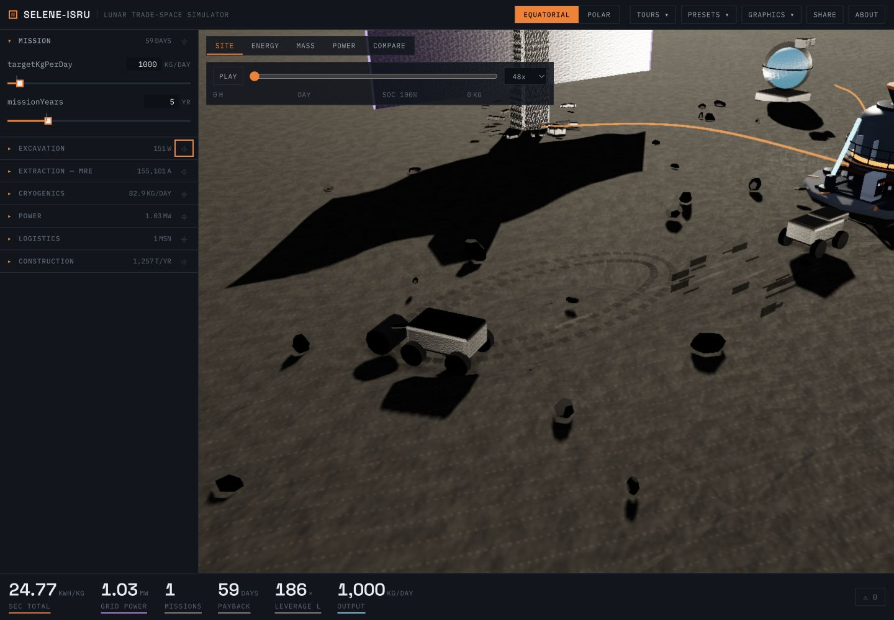 | 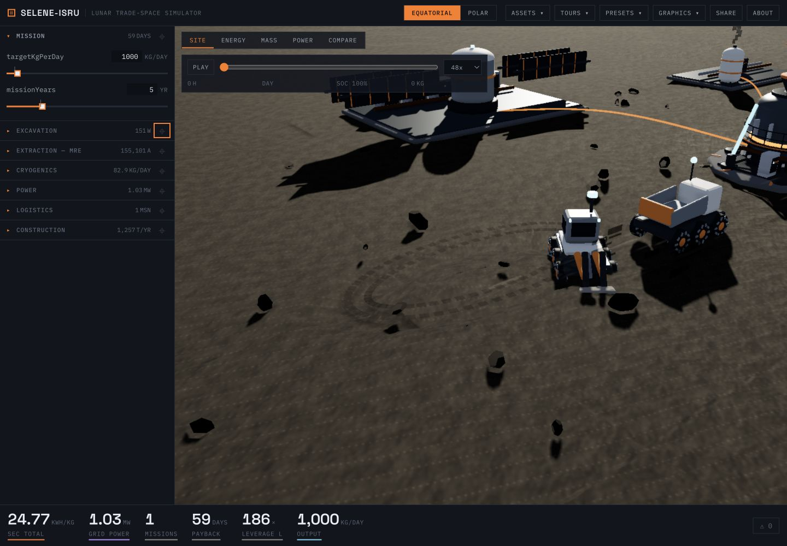 |

The excavator now has six treaded wheels, a human-scale cab, work lights, lidar, hydraulic boom, dipper, toothed bucket, and manufactured deck detail. The hauler has its own six-wheel chassis, pressure cab, hopper, antenna, and tip ram. Both sample the terrain height continuously instead of moving at a hard-coded world elevation. The excavator boom/bucket, hauler load, dump bed, traverse speed, and dust cadence remain linked to simulated excavation throughput.

### Slag casting yard

| Before — brick field only | After — process yard and output field |
| --- | --- |
| 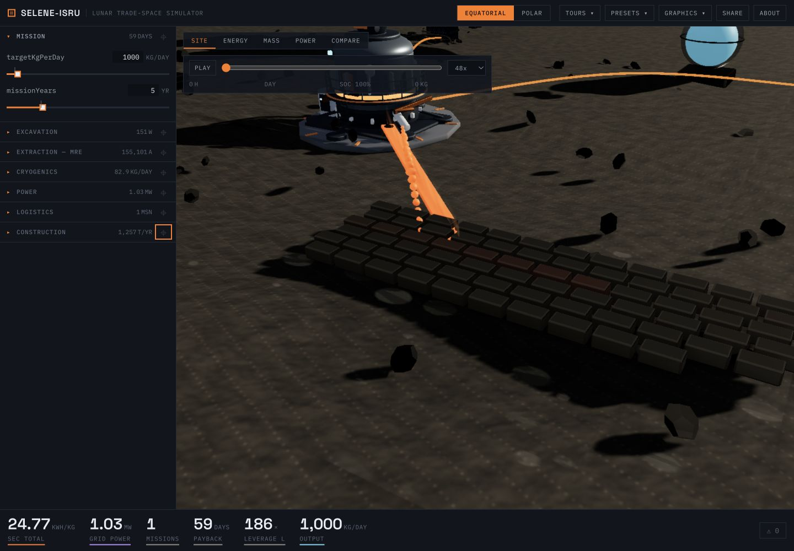 | 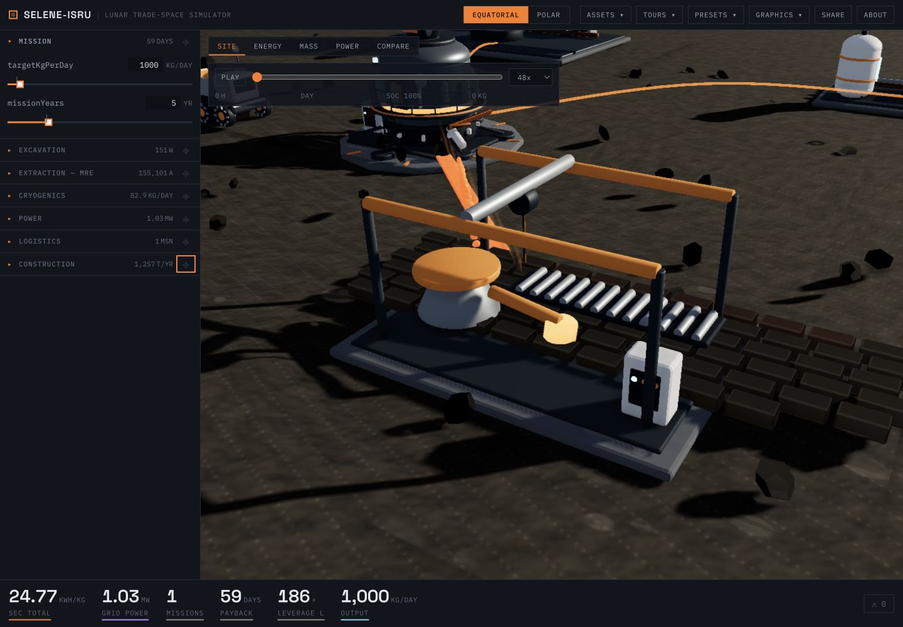 |

The output bricks now belong to a readable process area: graded slab, gantry, bridge crane, hoist, receiver hopper, articulated pour arm, mold conveyor, rollers, and control cabinet. The slag stream arrives at the receiver, the pour arm cycles, and brick count/cooling still reflect annual slag throughput and elapsed time.

### Cryogenic storage

| Before — single sphere placeholder | After — modular tank farm |
| --- | --- |
| 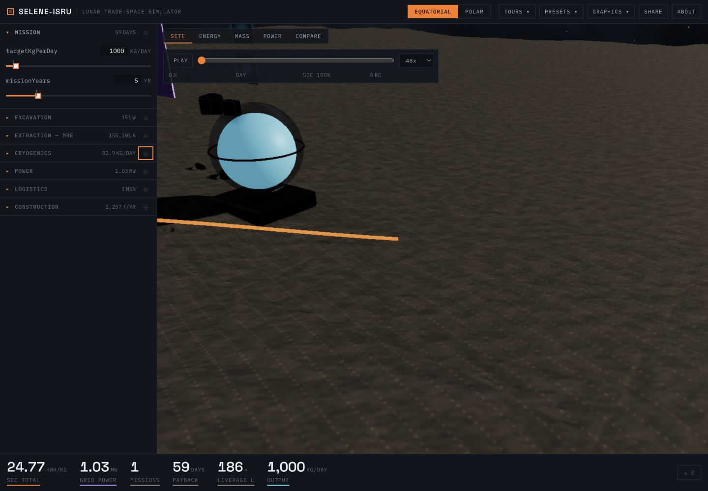 | 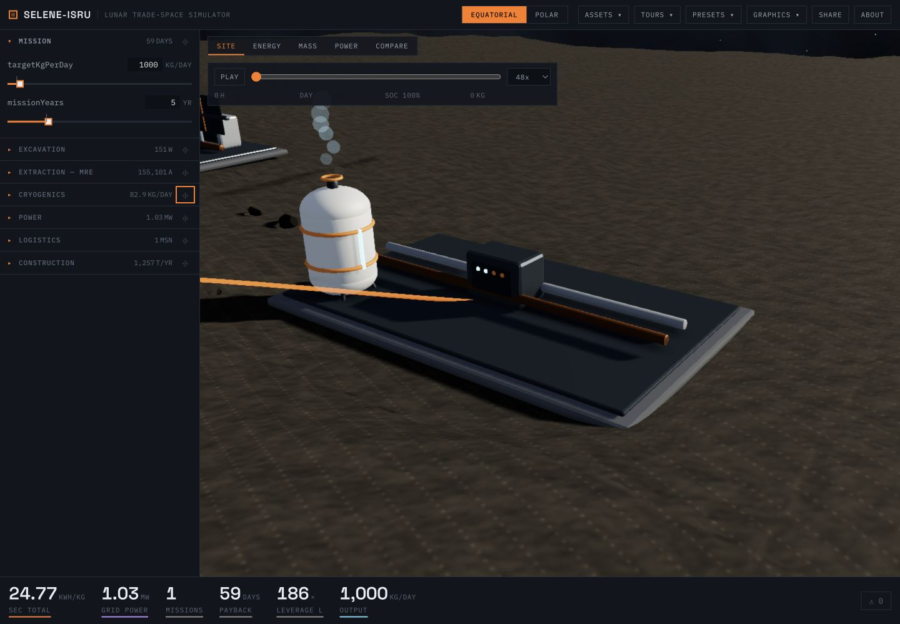 |

The new farm provides a load-spreading slab, eight individually addressable insulated vessels, support legs, MLI-colored shells, structural bands, header pipes, valves, fill indicators, switchgear, and restrained vapor. Calculated reserve volume controls visible tank count; reserve fill controls indicators; calculated boil-off controls the subtle vapor rate.

### Power system

| Before — monolith placeholder | After — integrated nuclear/solar hub |
| --- | --- |
| 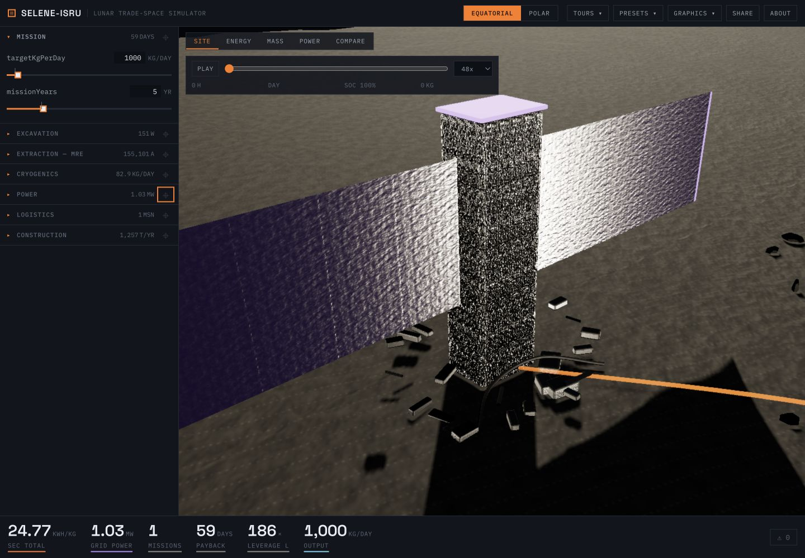 | 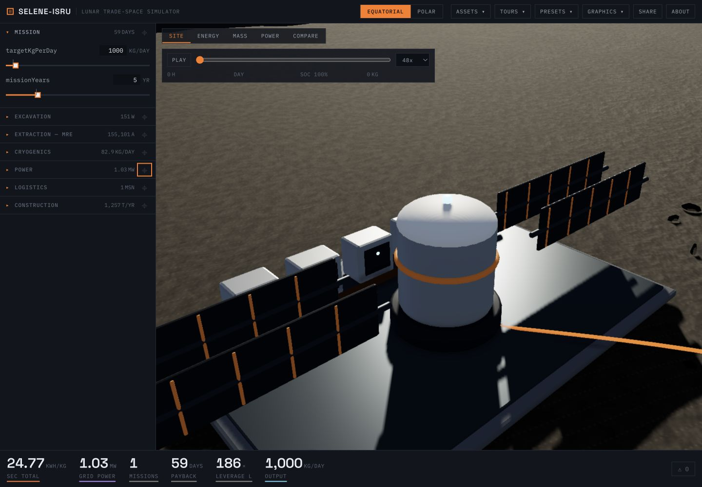 |

The power site now has a shared bus deck and switchgear plus authored solar and fission branches. The simulator selects the appropriate branch, solar rack count follows calculated array area, trackers follow the lunar-cycle sample, radiator span follows rejected-heat area, and status lighting follows grid load. The default screenshot shows the compact fission system and its four radiator wings—not photovoltaic panels.

### Landing system

| Before — dark silo and tiles | After — landed vehicle and service apron |
| --- | --- |
| 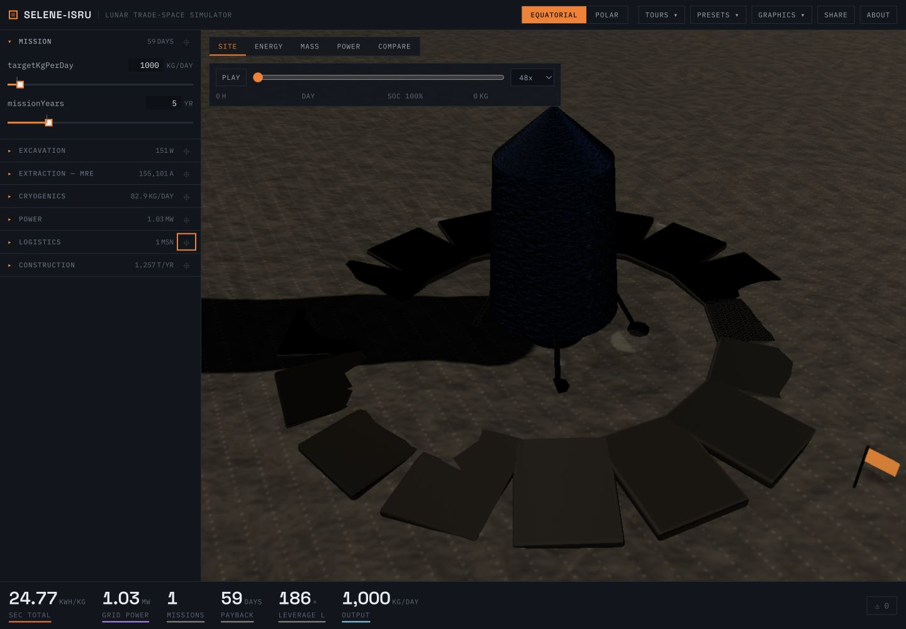 | 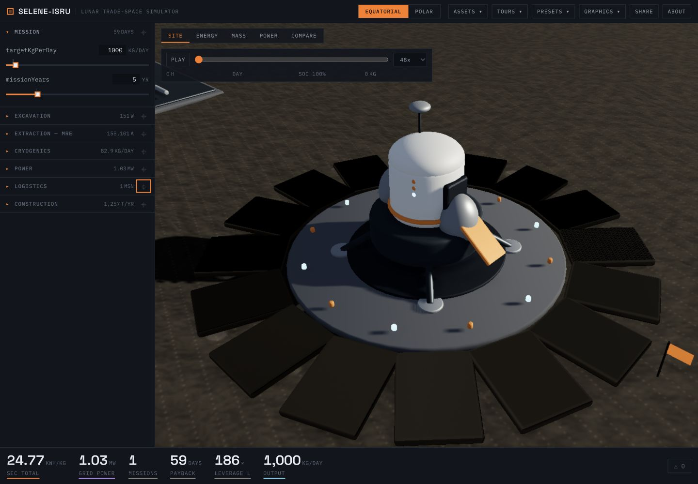 |

The landing site now reads as an operational system: central apron, blast plate, alternating beacons, descent stage, ascent cabin, propellant tanks, four braced legs and footpads, engines, airlock, access ramp, antenna, and status lamps. Pad tiles and mission flags still scale from construction/logistics results; the lander performs the existing restrained arrival/departure cycle with a stateful plume.

### Surface habitat

The original overview is retained as a matched whole-site comparison because the old UI had no habitat camera bookmark. The new accessible Assets menu adds that bookmark without changing the earlier baseline.

| Before — matched site overview | After — matched site overview |
| --- | --- |
| 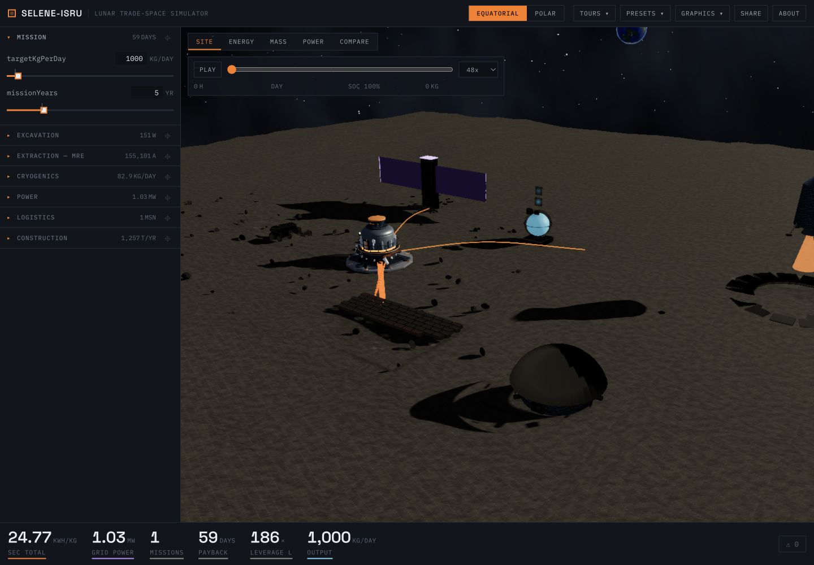 |  |

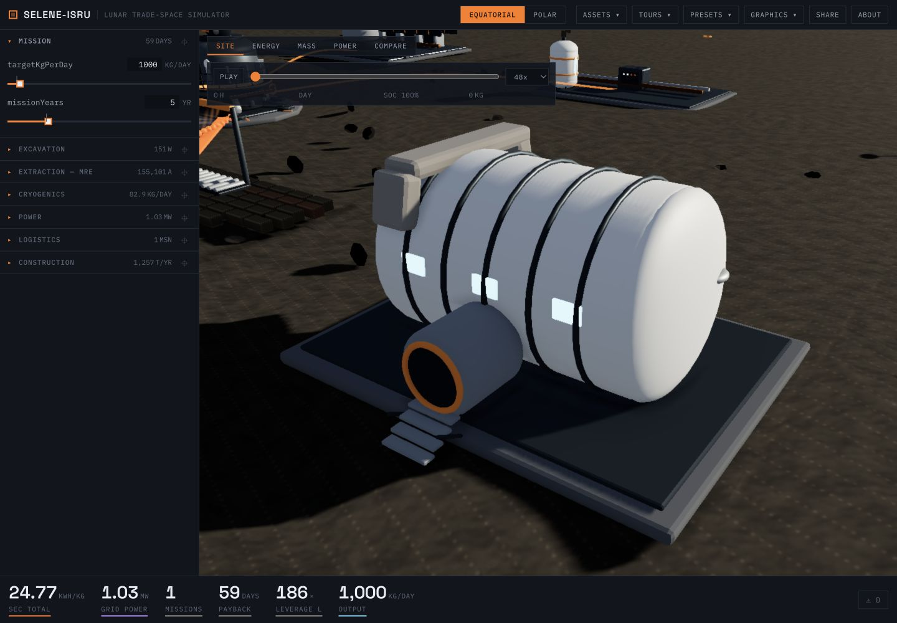

The habitat is now a pressure-rated cylindrical module with rounded endcaps, frame rings, lit windows, airlock, seal, stairs, radiator, communications mast, service deck, and six original regolith-shield sections. Visible sections quantize the selected shielding design, and the inspector explains design depth, full-balance depth, time to shield, and roof area.

## Grounding and legibility

Terrain generation and equipment placement now share one deterministic sampler for every fixed facility. The MRE reactor, casting yard, tank farm, power hub, landing system, and habitat each grade a compact service bench with blended shoulders. Their authored foundation undersides are placed 15 mm above the sampled grade with a dedicated contact treatment. The mobile excavation fleet samples the same carved terrain on every frame, so the wheels follow the trench and haul road rather than floating at `y = 0`.

The material system intentionally uses a limited technical-diorama palette: light thermal surfaces expose silhouette, dark structural steel retains contrast, safety orange marks interaction/service hardware, and cyan status elements carry simulator state. This keeps the site readable under the existing directional lunar lighting without flattening the scene into uniform ambient light.

## Interaction and simulator binding

- Hover, left-click/tap, and right-click now work across all eight equatorial systems, not only the reactor.
- Selection flies to the relevant camera pose, adds a cyan ground treatment, and opens a contextual inspector.
- The top-bar/mobile `ASSETS` menu provides accessible focus and selection for equipment that does not map cleanly to a parameter-rail section, especially the hauler and habitat.
- Each inspector reports four system-specific outputs, nominal/caution/alarm state, a short explanation of the visible dynamics, and curated live inputs.
- Simulator-driven components include excavation cadence and articulation, hauler load/dump state, casting motion and cooling, tank count/fill/vapor, power architecture/trackers/radiators, landing availability/flight/plume, and habitat shielding.

## Reproducible asset and rendering budget

All assets below are original Blender primitives with generated Principled BSDF materials. The single checked-in Python generator recreates each editable `.blend`, optimized GLB, and metrics file; no paid software, external mesh, downloaded texture, or restrictive material is used.

| Asset | Meshopt GLB | Raw GLB | Reduction | Meshes | Vertices | Triangles |
| --- | ---: | ---: | ---: | ---: | ---: | ---: |
| Excavation rover | 376,792 B | 671,756 B | 43.9% | 92 | 6,384 | 12,400 |
| Regolith hauler | 337,964 B | 616,868 B | 45.2% | 82 | 5,482 | 10,636 |
| Casting yard | 129,828 B | 190,892 B | 32.0% | 33 | 2,936 | 5,740 |
| Cryogenic farm | 533,936 B | 966,600 B | 44.8% | 106 | 20,384 | 40,440 |
| Power hub | 355,396 B | 597,396 B | 40.5% | 87 | 7,366 | 14,388 |
| Landing system | 193,012 B | 312,056 B | 38.1% | 39 | 5,844 | 11,536 |
| Habitat | 216,180 B | 406,844 B | 46.9% | 45 | 5,442 | 10,728 |
| **Total** | **2,143,108 B** | **3,762,412 B** | **43.0%** | **484** | **53,838** | **105,868** |

The editable Blender files total 1,215,191 bytes. The generated files were rebuilt twice from source with identical topology and near-identical byte sizes; small byte differences are expected because Blender embeds run metadata.

Relative to the reviewed MRE-only slice, the seven GLBs add 2,143,108 bytes (2.04 MiB) to the equatorial route. The shared loader, multi-asset picking, inspector, and state bindings add only about 11 kB raw / 4 kB gzip to the main JavaScript bundle; CSS is unchanged.

| Production output | MRE-only baseline | Full equatorial library | Change |
| --- | ---: | ---: | ---: |
| Main JS, raw | 1,088,386 B | 1,099,570 B | +11,184 B (+1.0%) |
| Main JS, gzip | 322.59 kB | 326.39 kB | +3.80 kB |
| CSS, raw | 26,977 B | 26,977 B | 0 B |
| New equatorial GLBs | — | 2,143,108 B | +2,143,108 B |

The approximate added transfer is 2,146,905 bytes (2.05 MiB): the seven GLBs plus compressed JavaScript growth. These GLBs are requested only when the equatorial diorama is constructed.

## Rendering performance

Short in-app EWMA samples were taken after all GLBs settled, using the same default scenario. The baseline is the reviewed MRE-only slice immediately before this batch.

| Viewport / tier | MRE-only baseline | Full equatorial library |
| --- | ---: | ---: |
| Desktop, 1440×1000, High | 56 FPS / 17.9 ms | 60 FPS / 16.7 ms |
| Mobile, 390×844, Medium | 60 FPS / 16.8 ms | 60 FPS / 16.7 ms |

These are directional local measurements rather than a laboratory benchmark. The existing render-on-demand loop, meshopt transfer compression, graphics tiers, capped DPR, and procedural instancing keep the additional geometry within the same settled frame budget. Renderer call/triangle values are omitted because the current multipass post stack resets Three.js counters before the HUD samples them.

## Verification and review stop

- `pnpm test`: 248 tests pass (220 engine, 28 app).
- `pnpm --filter @selene-isru/app build`: TypeScript and production Vite build pass.
- `pnpm run ci`: uv golden-vector generation, constants drift check, 6 Python tests, Ruff, 248 TypeScript tests, engine size check, and the production build all pass.
- Blender generator: all seven `.blend` and meshopt GLB outputs rebuilt twice from the checked-in source.
- Browser QA: desktop/mobile layouts, every Assets menu destination, canvas hover/select, right-click path, camera focus, close treatment, system metrics, live inputs, terrain contact, default solar/nuclear visibility, and settled performance samples.
- Photo-mode `Escape` and persistent exit control remain intact from the reactor slice.

This is the requested review stop before adapting the pipeline to the polar site.
