# Polar equipment overhaul

This checkpoint applies the equatorial hybrid procedural/Blender process to the
polar site while retaining the crater, beamed-power concept, simulator engine,
and existing UI. The equipment is original, reproducible, state-driven, and
available through the same desktop/mobile inspection workflow.

## What changed

Seven physical systems were rebuilt from checked-in Blender/Python source:

| System | Runtime behavior |
| --- | --- |
| Polar ice excavator | Terrain-sampled traverse, articulated cutter, throughput-scaled auger speed, and dust cadence |
| Sublimation camp | Three pressure tents, shared condenser manifold, moving valves, and energy-driven vent/status activity |
| Beam receiver + Sabatier plant | Narrower receiver beam, absorber status, optional reactor skid, moving valve, and live product metrics |
| Polar cryogenic farm | Reserve-scaled tank population, fill columns, status lighting, and boil-off vapor |
| Rim power towers | Three individually grounded lattice towers with cycle-driven trackers and daylight panel state |
| Polar nuclear station | Always discoverable as a dim standby system; activates with nuclear architecture and scales its radiator span |
| Polar habitat | Pressure shell, airlock, windows, radiator, and simulator-quantized shielding sections |

All fixed assets use the same deterministic terrain sampler as the crater mesh.
Small graded benches provide believable service foundations while the moving
excavator samples terrain height continuously. The permanently shadowed floor
has a cool readability lift rather than a false sun direction, and the beam was
reduced so it explains the power connection without obscuring the process line.

## Before and after

The baseline was captured before any polar code or model change. The after
views use the revised user-facing subsystem focus cameras, so the comparison is
system-matched rather than pixel-matched; camera framing is itself part of the
readability improvement.

### Whole site

| Before | After |
| --- | --- |
| 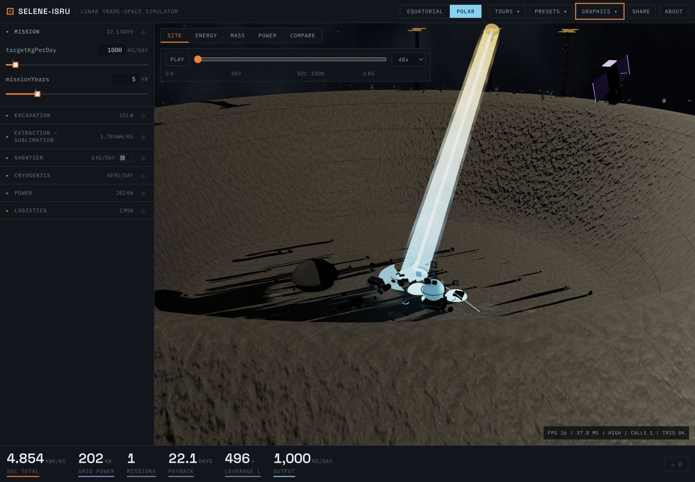 |  |

### Ice excavation

| Before | After |
| --- | --- |
| 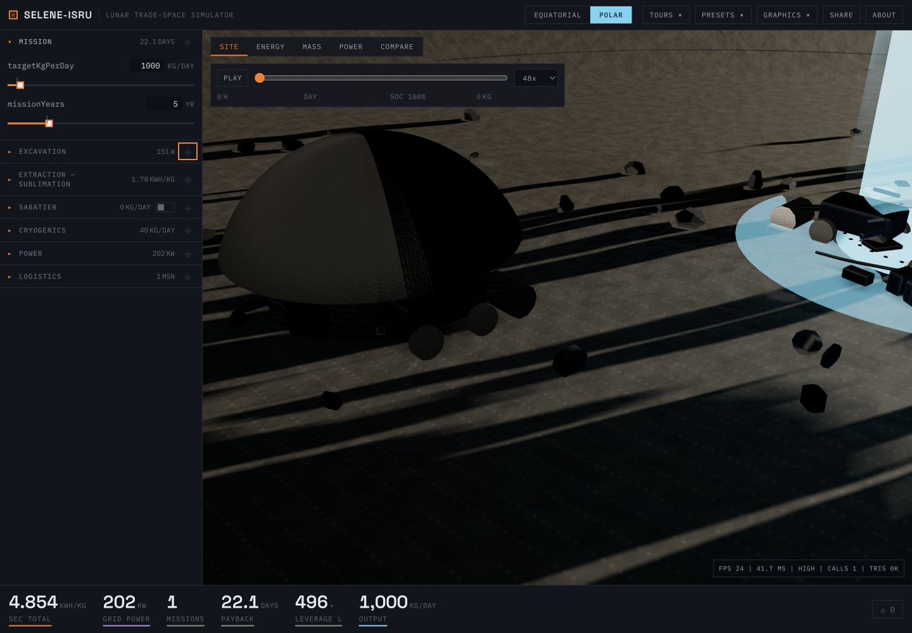 | 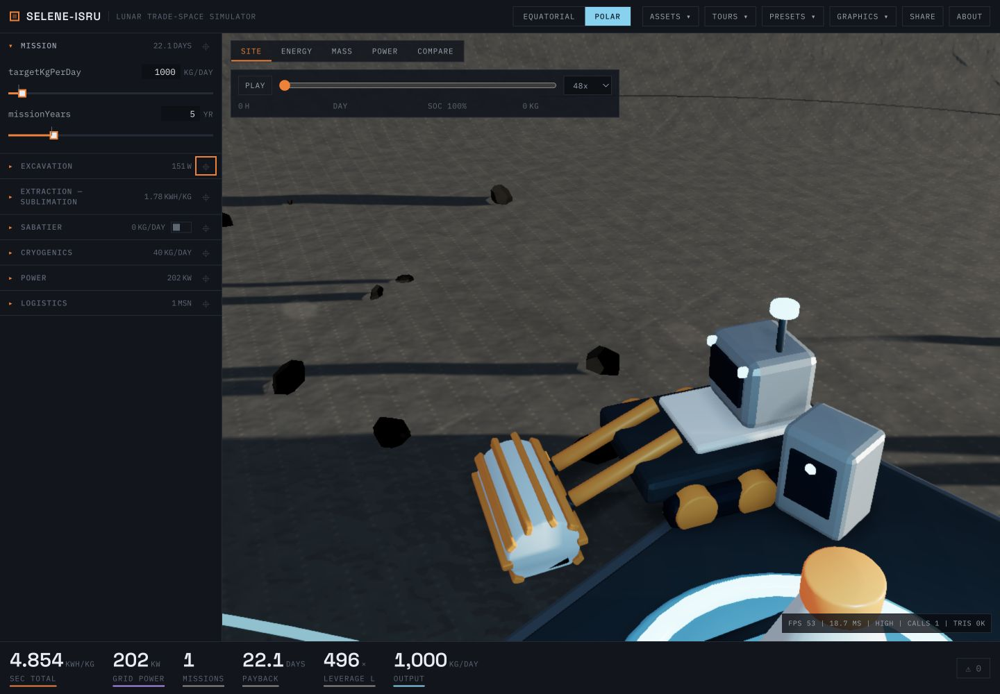 |

### Sublimation camp

| Before | After |
| --- | --- |
| 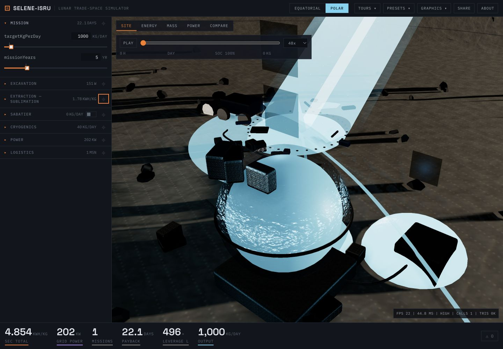 | 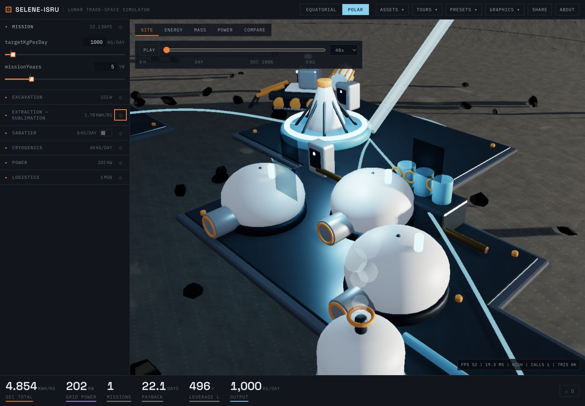 |

### Receiver and Sabatier plant

| Before | Receiver after | Sabatier enabled |
| --- | --- | --- |
| 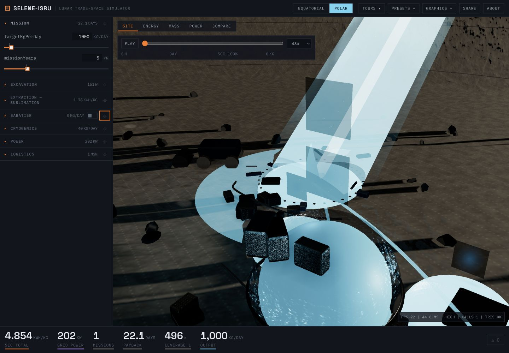 | 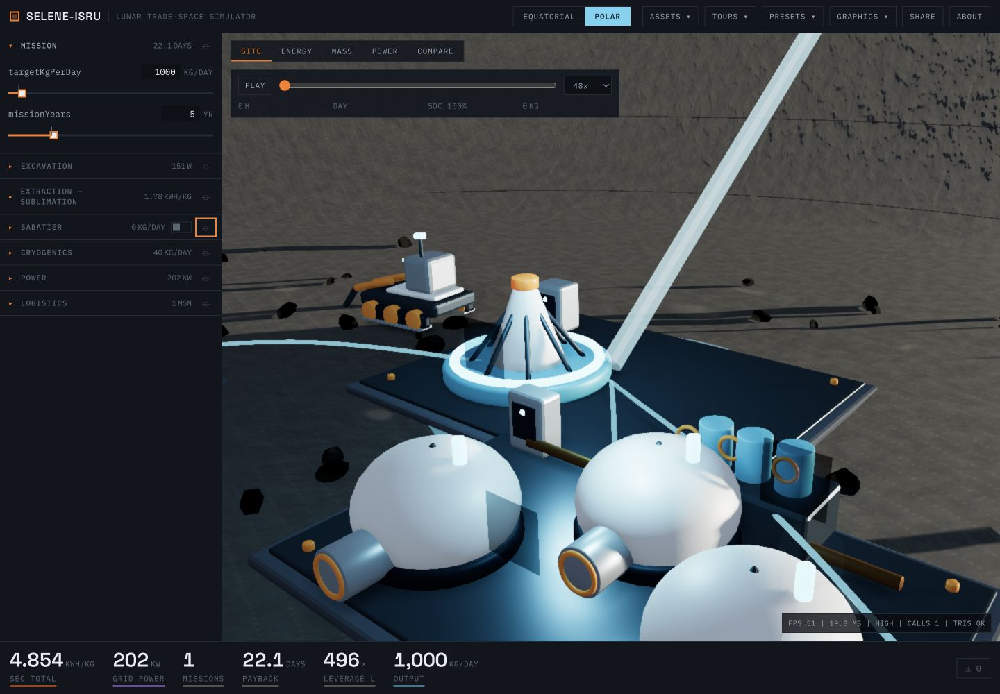 | 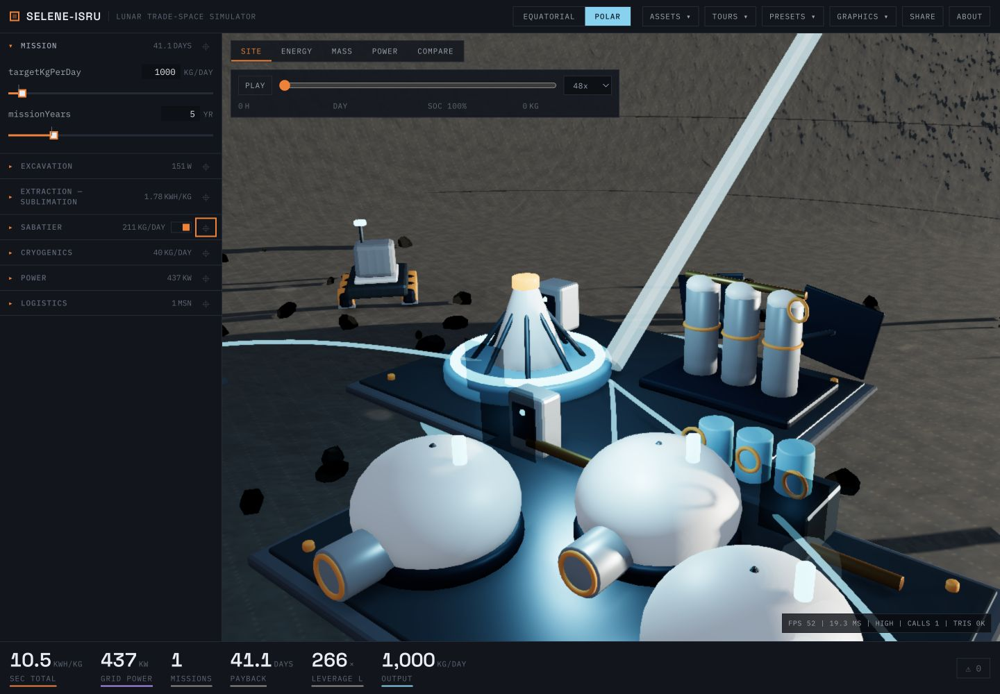 |

### Cryogenic farm

| Before | After |
| --- | --- |
| 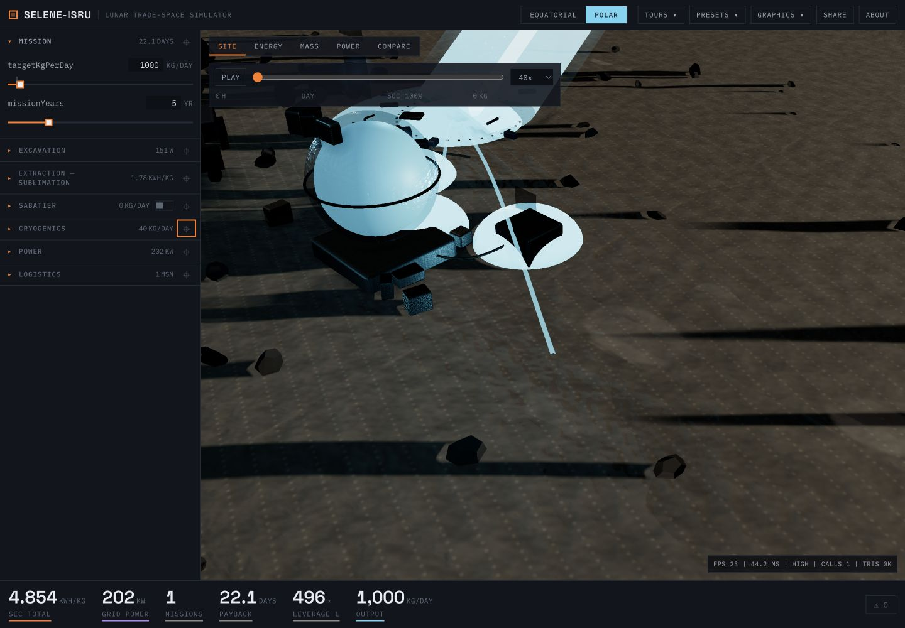 | 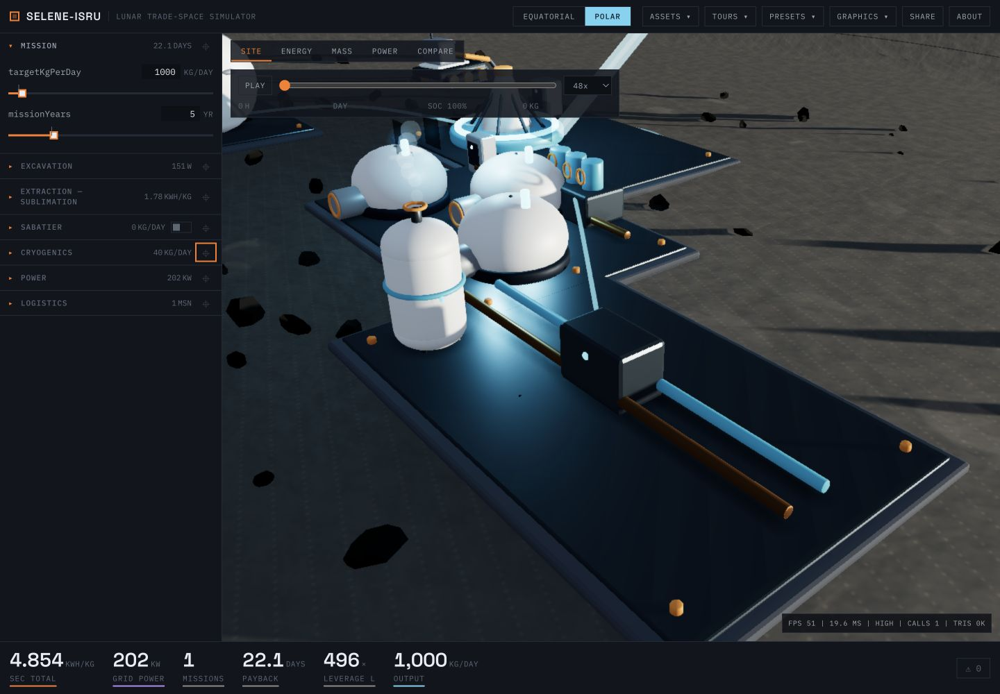 |

### Rim power system

| Before | After |
| --- | --- |
| 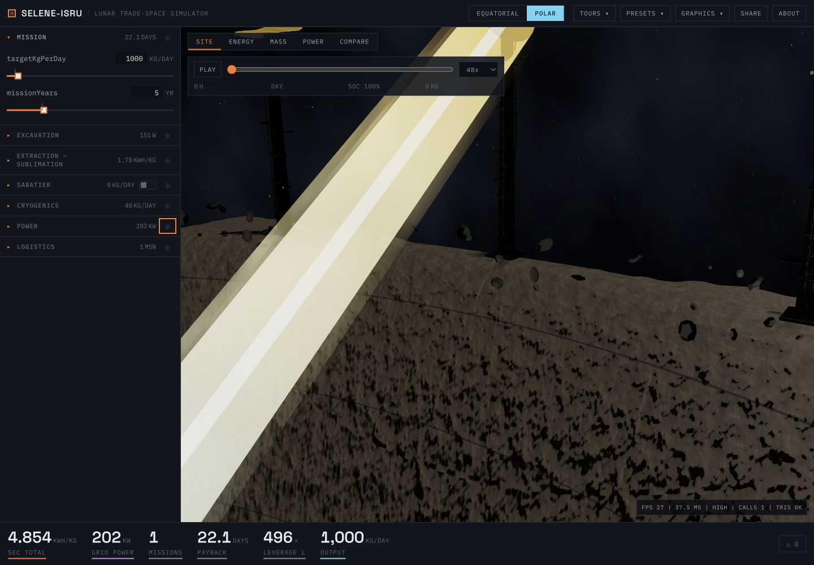 | 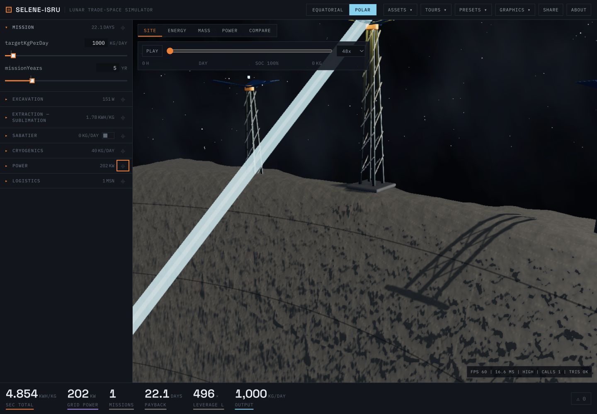 |

### Previously indistinct support systems

The old overview did not provide dedicated habitat or standby-nuclear focus
views. Both are now explicit assets with camera bookmarks and inspectors.

| Nuclear station after | Habitat after |
| --- | --- |
| 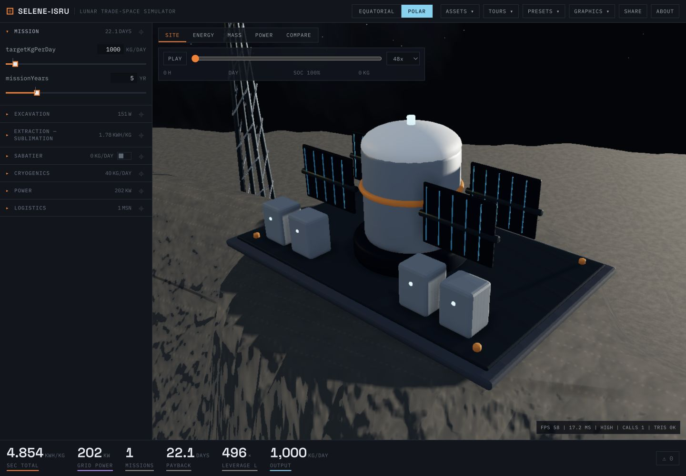 | 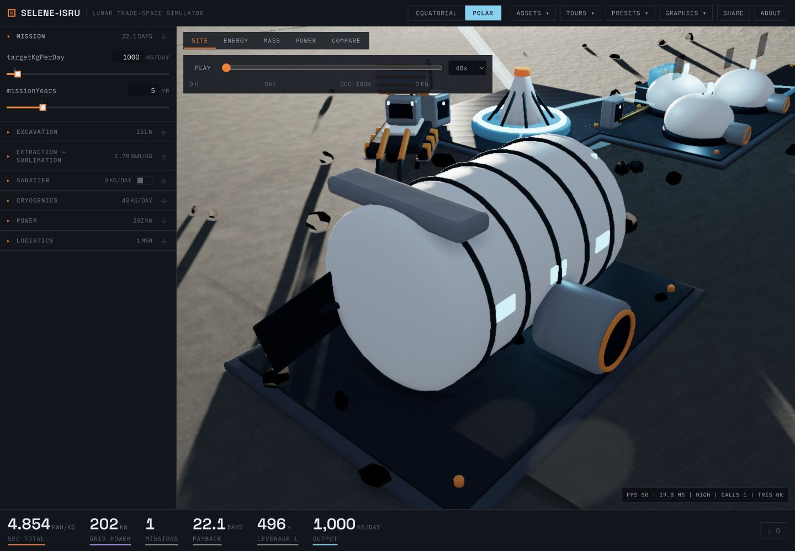 |

### Mobile

| Overview | Contextual inspector |
| --- | --- |
| 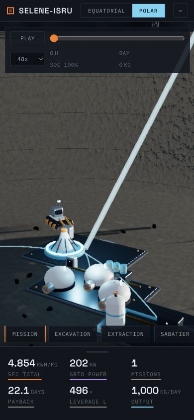 |  |

## Interaction and simulator binding

- The Assets menu is available on both desktop and mobile for all seven systems.
- Scene roots carry stable asset keys for hover, click/context-click selection,
  focus camera, outline treatment, and warning pulses.
- Each inspector reports four live outputs and exposes a curated set of the
  engine inputs that actually affect that subsystem.
- The Sabatier plant appears only when its loop is enabled; the inspector then
  reports methane, hydrogen, and oxygen production.
- The standby nuclear station remains faintly visible under the solar
  architecture, keeping the alternative discoverable without presenting it as
  the active branch.

Browser QA opened every Assets-menu destination and confirmed the correct
inspector. The Sabatier gate was exercised from off to on, producing 211 kg/day
CH₄, 111 kg/day H₂, and 889 kg/day O₂ in the captured default 1 t/day scenario.

## Asset and load budget

The generator is `assets/blender/polar_base/generate_polar_base.py`; editable
sources and measured geometry live beside it. Blender's bundled meshopt export
reduced the combined GLB payload from 3,191,928 to 1,924,796 bytes (39.7%).

| Asset | Optimized GLB | Triangles |
| --- | ---: | ---: |
| Polar excavator | 233,284 B | 7,524 |
| Sublimation camp | 253,708 B | 15,012 |
| Receiver plant | 174,084 B | 9,876 |
| Polar cryogenic farm | 469,496 B | 31,832 |
| Rim power towers | 444,308 B | 22,324 |
| Polar nuclear station | 198,660 B | 9,516 |
| Polar habitat | 151,256 B | 8,500 |
| **Total** | **1,924,796 B** | **104,584** |

The polar GLBs are fetched only when the polar diorama is constructed. Relative
to equatorial checkpoint `cad3c0c`, replacing the old procedural polar
equipment reduced the production JavaScript from 1,099,570 to 1,097,951 bytes
raw and from 326,387 to 324,771 bytes gzip. CSS stayed at 26,977 bytes raw.

## Rendering QA

Measured with the in-app development HUD after the assets had loaded:

| Viewport / tier | Before | After |
| --- | ---: | ---: |
| Desktop 1440×1000 / High | 27 FPS / 37.7 ms | 60 FPS / 16.7 ms |
| Mobile 390×844 / Medium | 60 FPS / 16.7 ms | 60 FPS / 16.7 ms |

The HUD's draw-call/triangle counters currently reset inside the post-processing
pipeline, so asset geometry is reported from Blender's deterministic export
metrics rather than that counter. Visual QA checked overview and focused views,
desktop/mobile inspectors, site switching, terrain contact, the Sabatier gate,
and all seven Assets-menu destinations.
