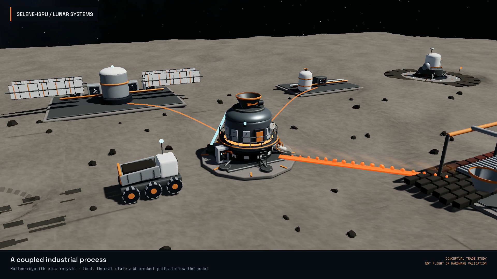
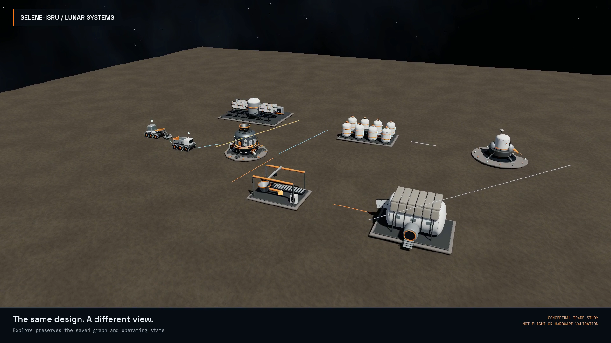

# Regenerated video review frames

These images were extracted from the final candidate encodes, not from the old media.
See the [showcase and review decisions](../../video-showcase.md) and
[exact media checksums](../../performance/video-release.json).

`*-01.jpg`, `*-02.jpg`, etc. are chronological four-by-four contact sheets:
one sample per second, read left to right, then top to bottom. Each sheet covers
the next 16 seconds; empty trailing cells are padding, not missing footage.
The five `*-ending.png` images show the final readable composition 1.5 seconds
before the end. Every file then fades to clean black, checked separately by the verifier.

All 17 contact sheets and five ending compositions were visually inspected,
along with full-resolution source-shot frames for UI and caption readability.
Complete decoding and sequential normal-speed browser playback complement these
samples; the samples alone are not proof of every intermediate motion frame.

## Posters from delivered frames

