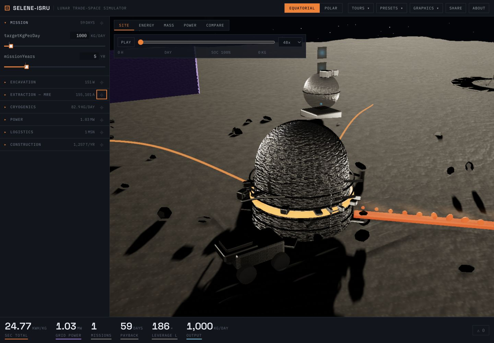
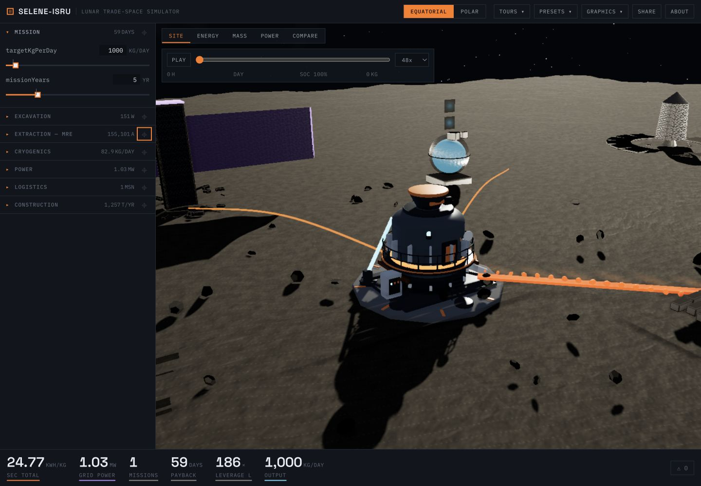
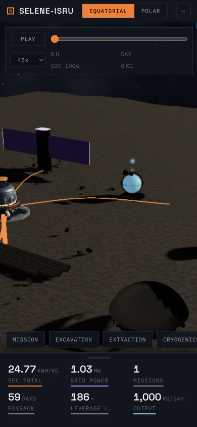
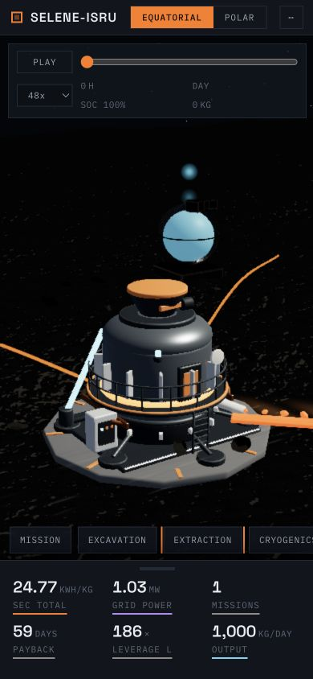

# Equatorial MRE vertical slice

This slice replaces the procedural placeholder reactor with an original, reproducibly generated Blender asset and connects it to the engineering simulator. Captures use the default 1,000 kg/day equatorial scenario at the start of the lunar cycle so the before/after views are directly comparable.

## Visual comparison

| Before — procedural placeholder | After — generated MRE system |
| --- | --- |
|  |  |

| Mobile overview | Mobile reactor focus |
| --- | --- |
|  |  |

The after state adds a graded foundation bench, load-spreading pad, service plinth, access ladder, handrails, cabinet, high-current bus bars, feed hopper, valve, gauge, product lines, and manufactured panel/fastener detail. The focused camera now frames the complete equipment footprint instead of cropping it.

## Interaction and simulator binding

- Hovering the reactor shows an orange ground treatment and a concise interaction label.
- Left-click, tap, or right-click selects it, flies the camera to the reactor, and opens a contextual inspector.
- The inspector reports O₂ output, cell current, electrolysis SEC, effective O₂ yield, status, and four curated live inputs.
- Feed gate, tap valve, gauge needle, thermal band, and status beacon are named GLB nodes driven by current, melt temperature, power, and elapsed simulation state.
- Photo mode now has a persistent `EXIT PHOTO MODE` control, exits with `Escape`, and is never persisted across reloads.

## Grounding

Terrain generation and asset placement now share one deterministic height sampler. The reactor footprint grades the noisy terrain into a compact service bench with blended shoulders; the foundation is placed from that sampled elevation with a 15 mm contact offset. This avoids both floating feet and buried slabs while preserving the surrounding terrain profile.

## Asset and load budget

| Item | Result |
| --- | ---: |
| Editable Blender source | 342,722 bytes |
| Generator source | 17,808 bytes |
| Unoptimized GLB export | 1,410,072 bytes |
| Meshopt GLB | 742,784 bytes |
| GLB reduction | 47.3% |
| Mesh objects | 119 |
| Vertices | 22,114 |
| Triangles | 43,780 |

The Blender generator was run twice successfully from the checked-in Python source, reproducing the same topology and byte sizes. The files are not byte-for-byte deterministic because Blender embeds run metadata. The asset uses only original primitive geometry and procedural Principled BSDF materials; see [`assets/ASSET_LICENSES.md`](../assets/ASSET_LICENSES.md).

Production build comparison, excluding unchanged font files:

| Asset | Before | After | Change |
| --- | ---: | ---: | ---: |
| Main JS, raw | 975,721 B | 1,088,386 B | +112,665 B (+11.5%) |
| Main JS, gzip | 290.61 kB | 322.59 kB | +31.98 kB |
| CSS, raw | 23,401 B | 26,977 B | +3,576 B (+15.3%) |
| CSS, gzip | 5.19 kB | 5.93 kB | +0.74 kB |
| Equatorial MRE GLB | — | 742,784 B | +742,784 B |

The approximate added transfer for the equatorial site is 775,504 bytes (about 757 KiB): the GLB plus compressed JS/CSS growth. The GLB is fetched only when the equatorial diorama is constructed.

## Rendering performance

Short in-app EWMA samples were captured after the scene and GLB had settled, using the same browser and default scenario.

| Viewport / automatic tier | Before | After |
| --- | ---: | ---: |
| Desktop, 1440×1000, High | 25 FPS / 40.1 ms | 56 FPS / 17.9 ms |
| Mobile, 390×844, Medium | 60 FPS / 16.7 ms | 60 FPS / 16.8 ms |

These are directional local measurements, not laboratory benchmarks. Draw-call and triangle values from the existing HUD are intentionally omitted because the multipass post-processing stack resets the renderer counters before they are sampled.

## Verification

- `pnpm test`: 248 tests pass (220 engine, 28 app).
- `pnpm build`: production build passes.
- Browser QA: desktop and mobile overview/focus captures, hover/select, contextual inspector, live input rendering, camera focus, Photo-mode button exit, Photo-mode `Escape` exit, and safe reload state.

This was the first review stop. The approved pipeline has since been applied to the remaining equatorial equipment; see [Equatorial base equipment overhaul](equatorial-asset-overhaul.md).
